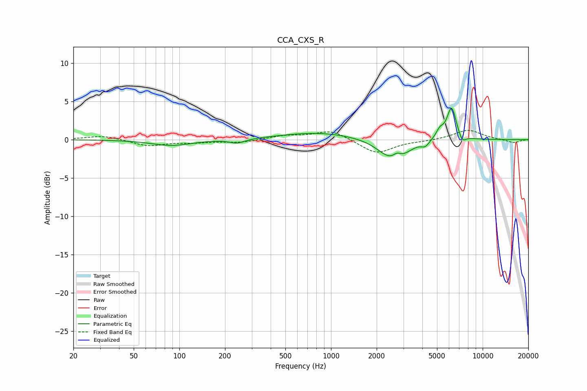

# CCA_CXS_R
See [usage instructions](https://github.com/jaakkopasanen/AutoEq#usage) for more options and info.

### Parametric EQs
Apply preamp of -4.2 dB when using parametric equalizer.

|   # | Type    |   Fc (Hz) |    Q |   Gain (dB) |
|-----|---------|-----------|------|-------------|
|   1 | Peaking |        89 | 1.08 |        -0.8 |
|   2 | Peaking |       242 | 2.79 |        -0.5 |
|   3 | Peaking |       824 | 0.57 |         0.9 |
|   4 | Peaking |      2442 | 1.67 |        -2.2 |
|   5 | Peaking |      2720 | 6    |         0.6 |
|   6 | Peaking |      3011 | 2.14 |        -0.8 |
|   7 | Peaking |      4185 | 5.46 |        -0.7 |
|   8 | Peaking |      5218 | 5.56 |         1.1 |
|   9 | Peaking |      6243 | 4.42 |         4.3 |
|  10 | Peaking |      7334 | 5.77 |        -1   |

### Fixed Band EQs
When using fixed band (also called graphic) equalizer, apply preamp of **-1.3 dB** (if available) and set gains manually with these parameters.

|   # | Type    |   Fc (Hz) |    Q |   Gain (dB) |
|-----|---------|-----------|------|-------------|
|   1 | Peaking |        31 | 1.41 |         0.5 |
|   2 | Peaking |        62 | 1.41 |        -0.8 |
|   3 | Peaking |       125 | 1.41 |        -0.3 |
|   4 | Peaking |       250 | 1.41 |        -0.4 |
|   5 | Peaking |       500 | 1.41 |         0.5 |
|   6 | Peaking |      1000 | 1.41 |         1.2 |
|   7 | Peaking |      2000 | 1.41 |        -1.9 |
|   8 | Peaking |      4000 | 1.41 |        -0.1 |
|   9 | Peaking |      8000 | 1.41 |         1.3 |
|  10 | Peaking |     16000 | 1.41 |        -0.4 |

### Graphs

