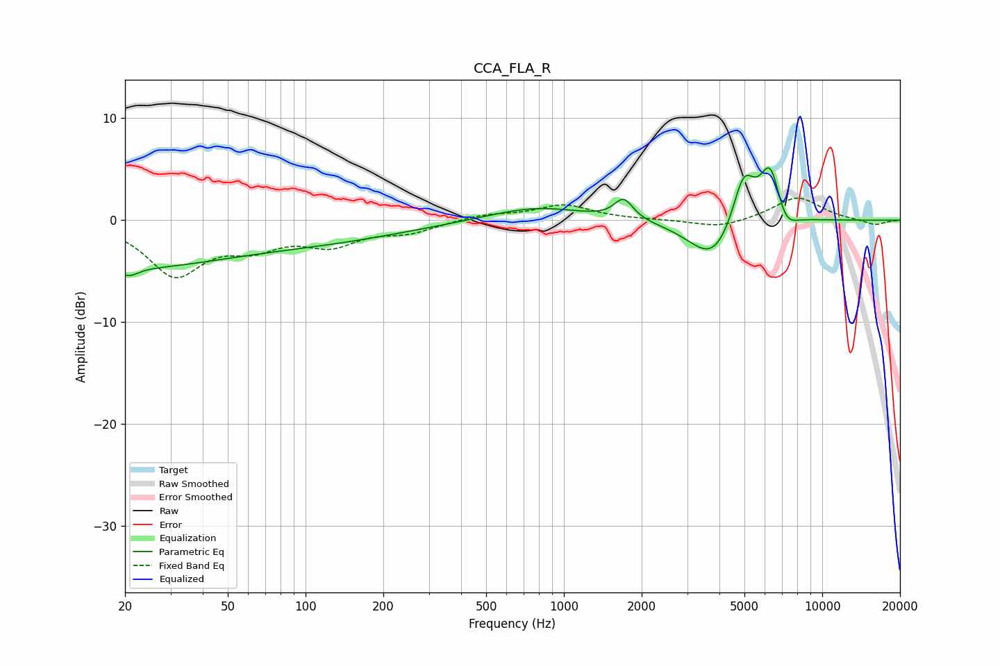

# CCA_FLA_R
See [usage instructions](https://github.com/jaakkopasanen/AutoEq#usage) for more options and info.

### Parametric EQs
Apply preamp of -5.2 dB when using parametric equalizer.

|   # | Type    |   Fc (Hz) |    Q |   Gain (dB) |
|-----|---------|-----------|------|-------------|
|   1 | Peaking |        20 | 0.36 |        -4.3 |
|   2 | Peaking |        21 | 5.27 |        -3.7 |
|   3 | Peaking |        21 | 5.73 |         2.9 |
|   4 | Peaking |       116 | 0.42 |        -1.7 |
|   5 | Peaking |       783 | 0.77 |         1.4 |
|   6 | Peaking |      1703 | 3.95 |         2   |
|   7 | Peaking |      3787 | 1.5  |        -4.2 |
|   8 | Peaking |      4962 | 3.14 |         5.3 |
|   9 | Peaking |      6301 | 3.34 |         5.7 |
|  10 | Peaking |      7172 | 3.19 |        -2   |

### Fixed Band EQs
When using fixed band (also called graphic) equalizer, apply preamp of **-2.3 dB** (if available) and set gains manually with these parameters.

|   # | Type    |   Fc (Hz) |    Q |   Gain (dB) |
|-----|---------|-----------|------|-------------|
|   1 | Peaking |        31 | 1.41 |        -5.2 |
|   2 | Peaking |        62 | 1.41 |        -2.1 |
|   3 | Peaking |       125 | 1.41 |        -2.1 |
|   4 | Peaking |       250 | 1.41 |        -1   |
|   5 | Peaking |       500 | 1.41 |         0.5 |
|   6 | Peaking |      1000 | 1.41 |         1.5 |
|   7 | Peaking |      2000 | 1.41 |         0   |
|   8 | Peaking |      4000 | 1.41 |        -0.8 |
|   9 | Peaking |      8000 | 1.41 |         2.3 |
|  10 | Peaking |     16000 | 1.41 |        -0.5 |

### Graphs

