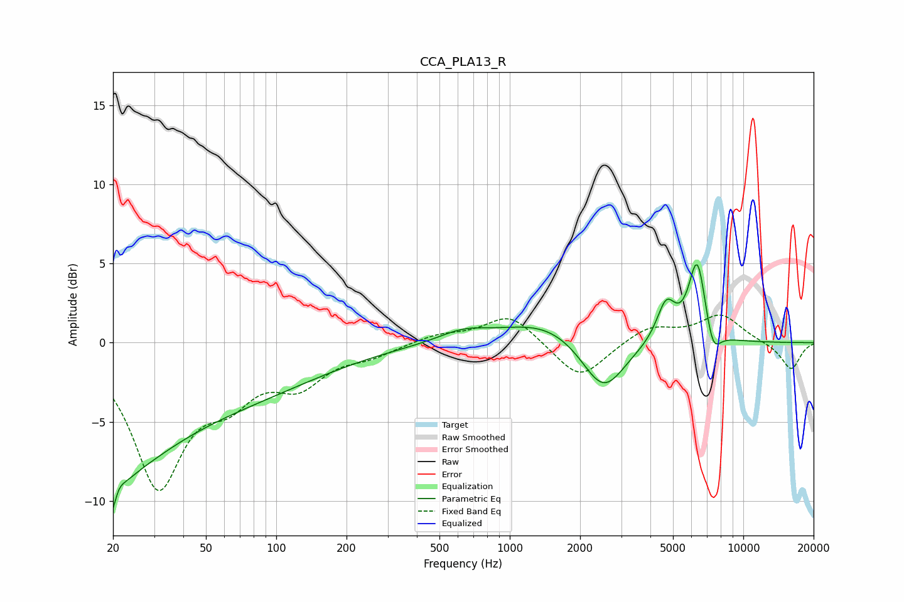

# CCA_PLA13_R
See [usage instructions](https://github.com/jaakkopasanen/AutoEq#usage) for more options and info.

### Parametric EQs
Apply preamp of -5.0 dB when using parametric equalizer.

|   # | Type    |   Fc (Hz) |    Q |   Gain (dB) |
|-----|---------|-----------|------|-------------|
|   1 | Peaking |        20 | 4.07 |        -6.4 |
|   2 | Peaking |        20 | 0.64 |        -5.3 |
|   3 | Peaking |        21 | 4.83 |         3.9 |
|   4 | Peaking |        52 | 0.32 |        -3.4 |
|   5 | Peaking |       633 | 1.29 |         0.7 |
|   6 | Peaking |      1418 | 0.78 |         1.4 |
|   7 | Peaking |      2516 | 1.52 |        -3.4 |
|   8 | Peaking |      4674 | 3.42 |         2.5 |
|   9 | Peaking |      6353 | 3.68 |         5.2 |
|  10 | Peaking |      7404 | 4.19 |        -1.8 |

### Fixed Band EQs
When using fixed band (also called graphic) equalizer, apply preamp of **-1.8 dB** (if available) and set gains manually with these parameters.

|   # | Type    |   Fc (Hz) |    Q |   Gain (dB) |
|-----|---------|-----------|------|-------------|
|   1 | Peaking |        31 | 1.41 |        -8.8 |
|   2 | Peaking |        62 | 1.41 |        -2.6 |
|   3 | Peaking |       125 | 1.41 |        -2.3 |
|   4 | Peaking |       250 | 1.41 |        -0.7 |
|   5 | Peaking |       500 | 1.41 |         0.5 |
|   6 | Peaking |      1000 | 1.41 |         1.8 |
|   7 | Peaking |      2000 | 1.41 |        -2.4 |
|   8 | Peaking |      4000 | 1.41 |         1   |
|   9 | Peaking |      8000 | 1.41 |         1.7 |
|  10 | Peaking |     16000 | 1.41 |        -1.7 |

### Graphs

