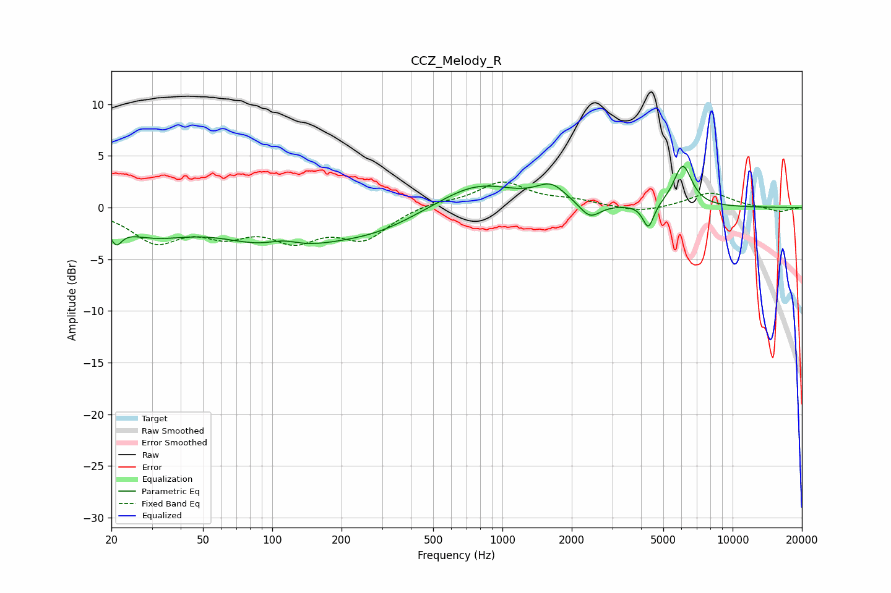

# CCZ_Melody_R
See [usage instructions](https://github.com/jaakkopasanen/AutoEq#usage) for more options and info.

### Parametric EQs
Apply preamp of -4.1 dB when using parametric equalizer.

|   # | Type    |   Fc (Hz) |    Q |   Gain (dB) |
|-----|---------|-----------|------|-------------|
|   1 | Peaking |        21 | 5.78 |        -1.6 |
|   2 | Peaking |        30 | 0.85 |        -2.2 |
|   3 | Peaking |       109 | 0.63 |        -3.6 |
|   4 | Peaking |       111 | 1.8  |         1   |
|   5 | Peaking |       281 | 0.74 |        -1.7 |
|   6 | Peaking |       776 | 0.84 |         2.5 |
|   7 | Peaking |      1628 | 2.2  |         1.7 |
|   8 | Peaking |      2399 | 3.19 |        -1.5 |
|   9 | Peaking |      4306 | 6    |        -2.4 |
|  10 | Peaking |      6074 | 3.48 |         4   |

### Fixed Band EQs
When using fixed band (also called graphic) equalizer, apply preamp of **-2.6 dB** (if available) and set gains manually with these parameters.

|   # | Type    |   Fc (Hz) |    Q |   Gain (dB) |
|-----|---------|-----------|------|-------------|
|   1 | Peaking |        31 | 1.41 |        -3.1 |
|   2 | Peaking |        62 | 1.41 |        -2.1 |
|   3 | Peaking |       125 | 1.41 |        -2.7 |
|   4 | Peaking |       250 | 1.41 |        -2.8 |
|   5 | Peaking |       500 | 1.41 |         0.5 |
|   6 | Peaking |      1000 | 1.41 |         2.4 |
|   7 | Peaking |      2000 | 1.41 |         0.6 |
|   8 | Peaking |      4000 | 1.41 |        -0.6 |
|   9 | Peaking |      8000 | 1.41 |         1.5 |
|  10 | Peaking |     16000 | 1.41 |        -0.4 |

### Graphs

