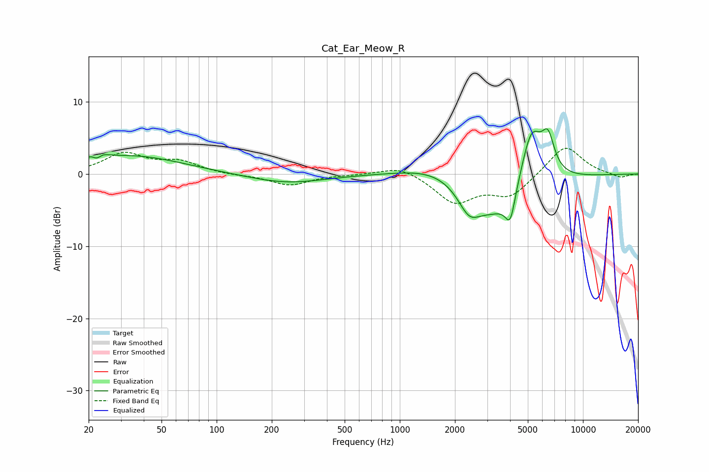

# Cat_Ear_Meow_R
See [usage instructions](https://github.com/jaakkopasanen/AutoEq#usage) for more options and info.

### Parametric EQs
Apply preamp of -6.3 dB when using parametric equalizer.

|   # | Type    |   Fc (Hz) |    Q |   Gain (dB) |
|-----|---------|-----------|------|-------------|
|   1 | Peaking |        22 | 3.83 |         2.3 |
|   2 | Peaking |        22 | 5.47 |        -2.1 |
|   3 | Peaking |        34 | 0.51 |         2.5 |
|   4 | Peaking |       240 | 0.68 |        -1.3 |
|   5 | Peaking |      1659 | 0.76 |         2.1 |
|   6 | Peaking |      2387 | 2.47 |        -3   |
|   7 | Peaking |      3393 | 0.81 |        -6.7 |
|   8 | Peaking |      4014 | 5.14 |        -4   |
|   9 | Peaking |      5226 | 2.17 |         8.9 |
|  10 | Peaking |      6448 | 3.98 |         4.5 |

### Fixed Band EQs
When using fixed band (also called graphic) equalizer, apply preamp of **-3.7 dB** (if available) and set gains manually with these parameters.

|   # | Type    |   Fc (Hz) |    Q |   Gain (dB) |
|-----|---------|-----------|------|-------------|
|   1 | Peaking |        31 | 1.41 |         2.7 |
|   2 | Peaking |        62 | 1.41 |         1.6 |
|   3 | Peaking |       125 | 1.41 |        -0.2 |
|   4 | Peaking |       250 | 1.41 |        -1.5 |
|   5 | Peaking |       500 | 1.41 |        -0.1 |
|   6 | Peaking |      1000 | 1.41 |         1.3 |
|   7 | Peaking |      2000 | 1.41 |        -3.9 |
|   8 | Peaking |      4000 | 1.41 |        -3   |
|   9 | Peaking |      8000 | 1.41 |         4.1 |
|  10 | Peaking |     16000 | 1.41 |        -0.6 |

### Graphs

