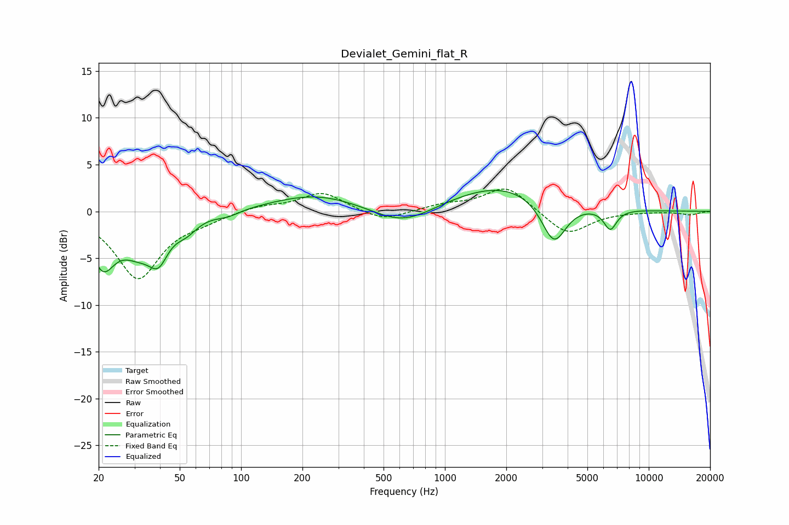

# Devialet_Gemini_flat_R
See [usage instructions](https://github.com/jaakkopasanen/AutoEq#usage) for more options and info.

### Parametric EQs
Apply preamp of -2.3 dB when using parametric equalizer.

|   # | Type    |   Fc (Hz) |    Q |   Gain (dB) |
|-----|---------|-----------|------|-------------|
|   1 | Peaking |        21 | 2.38 |        -5   |
|   2 | Peaking |        31 | 1.6  |        -3.2 |
|   3 | Peaking |        39 | 3    |        -3.2 |
|   4 | Peaking |        54 | 2.58 |        -1.3 |
|   5 | Peaking |        86 | 2.36 |        -0.6 |
|   6 | Peaking |       234 | 0.65 |         1.8 |
|   7 | Peaking |       623 | 0.95 |        -2.1 |
|   8 | Peaking |      1916 | 0.55 |         2.9 |
|   9 | Peaking |      3424 | 2.3  |        -4.8 |
|  10 | Peaking |      6477 | 4.25 |        -2.2 |

### Fixed Band EQs
When using fixed band (also called graphic) equalizer, apply preamp of **-2.5 dB** (if available) and set gains manually with these parameters.

|   # | Type    |   Fc (Hz) |    Q |   Gain (dB) |
|-----|---------|-----------|------|-------------|
|   1 | Peaking |        31 | 1.41 |        -7.1 |
|   2 | Peaking |        62 | 1.41 |        -0.7 |
|   3 | Peaking |       125 | 1.41 |         0.6 |
|   4 | Peaking |       250 | 1.41 |         2   |
|   5 | Peaking |       500 | 1.41 |        -1.1 |
|   6 | Peaking |      1000 | 1.41 |         0.6 |
|   7 | Peaking |      2000 | 1.41 |         2.7 |
|   8 | Peaking |      4000 | 1.41 |        -2.6 |
|   9 | Peaking |      8000 | 1.41 |        -0   |
|  10 | Peaking |     16000 | 1.41 |        -0.4 |

### Graphs

