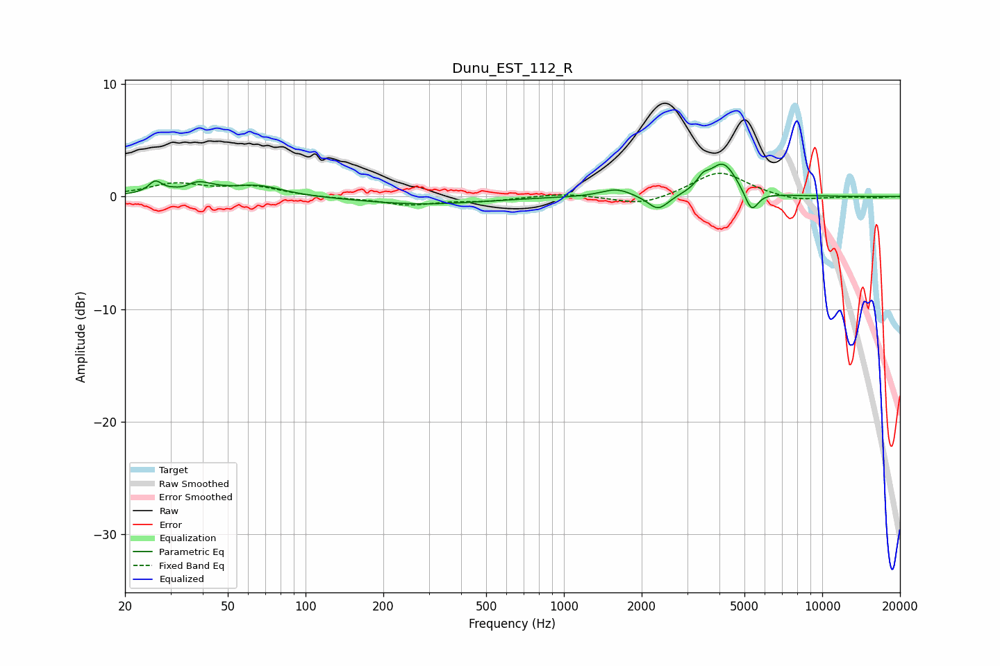

# Dunu_EST_112_R
See [usage instructions](https://github.com/jaakkopasanen/AutoEq#usage) for more options and info.

### Parametric EQs
Apply preamp of -3.0 dB when using parametric equalizer.

|   # | Type    |   Fc (Hz) |    Q |   Gain (dB) |
|-----|---------|-----------|------|-------------|
|   1 | Peaking |        26 | 5.87 |         1   |
|   2 | Peaking |        34 | 3.86 |        -0.6 |
|   3 | Peaking |        37 | 2.15 |         1.4 |
|   4 | Peaking |        65 | 1.43 |         0.9 |
|   5 | Peaking |       281 | 0.6  |        -0.7 |
|   6 | Peaking |      1596 | 2.42 |         0.7 |
|   7 | Peaking |      2317 | 3.49 |        -1.4 |
|   8 | Peaking |      3452 | 6    |         0.8 |
|   9 | Peaking |      4131 | 2.62 |         3   |
|  10 | Peaking |      5323 | 5.33 |        -1.9 |

### Fixed Band EQs
When using fixed band (also called graphic) equalizer, apply preamp of **-2.2 dB** (if available) and set gains manually with these parameters.

|   # | Type    |   Fc (Hz) |    Q |   Gain (dB) |
|-----|---------|-----------|------|-------------|
|   1 | Peaking |        31 | 1.41 |         1.1 |
|   2 | Peaking |        62 | 1.41 |         0.8 |
|   3 | Peaking |       125 | 1.41 |        -0.1 |
|   4 | Peaking |       250 | 1.41 |        -0.7 |
|   5 | Peaking |       500 | 1.41 |        -0.4 |
|   6 | Peaking |      1000 | 1.41 |         0.3 |
|   7 | Peaking |      2000 | 1.41 |        -0.8 |
|   8 | Peaking |      4000 | 1.41 |         2.3 |
|   9 | Peaking |      8000 | 1.41 |        -0.5 |
|  10 | Peaking |     16000 | 1.41 |        -0.1 |

### Graphs

