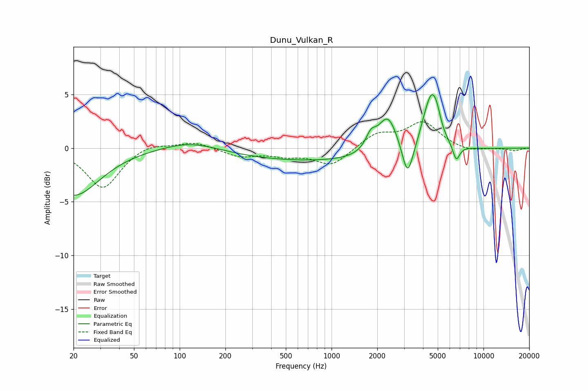

# Dunu_Vulkan_R
See [usage instructions](https://github.com/jaakkopasanen/AutoEq#usage) for more options and info.

### Parametric EQs
Apply preamp of -5.1 dB when using parametric equalizer.

|   # | Type    |   Fc (Hz) |    Q |   Gain (dB) |
|-----|---------|-----------|------|-------------|
|   1 | Peaking |        20 | 0.83 |        -4.4 |
|   2 | Peaking |       119 | 0.78 |         0.8 |
|   3 | Peaking |       928 | 0.21 |        -1.3 |
|   4 | Peaking |      1815 | 4.13 |         1.3 |
|   5 | Peaking |      2345 | 2.17 |         3.7 |
|   6 | Peaking |      3165 | 3.99 |        -3.3 |
|   7 | Peaking |      4029 | 4.91 |         0.4 |
|   8 | Peaking |      4556 | 2.91 |         5.1 |
|   9 | Peaking |      4954 | 6    |         0.7 |
|  10 | Peaking |      6620 | 5.96 |        -1.5 |

### Fixed Band EQs
When using fixed band (also called graphic) equalizer, apply preamp of **-2.5 dB** (if available) and set gains manually with these parameters.

|   # | Type    |   Fc (Hz) |    Q |   Gain (dB) |
|-----|---------|-----------|------|-------------|
|   1 | Peaking |        31 | 1.41 |        -3.8 |
|   2 | Peaking |        62 | 1.41 |         0.6 |
|   3 | Peaking |       125 | 1.41 |         0.6 |
|   4 | Peaking |       250 | 1.41 |        -0.8 |
|   5 | Peaking |       500 | 1.41 |        -0.6 |
|   6 | Peaking |      1000 | 1.41 |        -1.6 |
|   7 | Peaking |      2000 | 1.41 |         1.3 |
|   8 | Peaking |      4000 | 1.41 |         2.3 |
|   9 | Peaking |      8000 | 1.41 |        -0.4 |
|  10 | Peaking |     16000 | 1.41 |        -0.2 |

### Graphs

