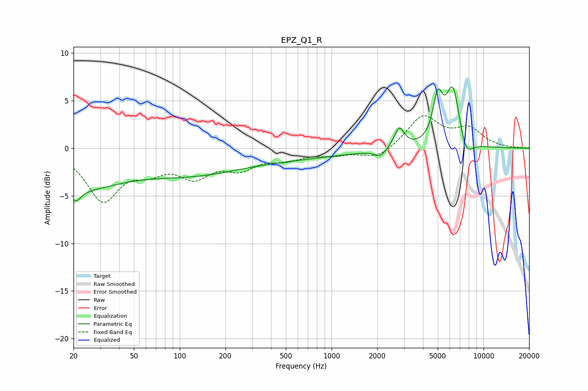

# EPZ_Q1_R
See [usage instructions](https://github.com/jaakkopasanen/AutoEq#usage) for more options and info.

### Parametric EQs
Apply preamp of -6.5 dB when using parametric equalizer.

|   # | Type    |   Fc (Hz) |    Q |   Gain (dB) |
|-----|---------|-----------|------|-------------|
|   1 | Peaking |        20 | 0.45 |        -4   |
|   2 | Peaking |        21 | 4.41 |        -1.2 |
|   3 | Peaking |       113 | 0.45 |        -2   |
|   4 | Peaking |       435 | 0.3  |        -1   |
|   5 | Peaking |      2091 | 3.64 |        -0.8 |
|   6 | Peaking |      2791 | 4.22 |         2.2 |
|   7 | Peaking |      5003 | 4.42 |         4.4 |
|   8 | Peaking |      6070 | 6    |        -0.1 |
|   9 | Peaking |      6299 | 2.88 |         6.5 |
|  10 | Peaking |      7619 | 2.96 |        -2.3 |

### Fixed Band EQs
When using fixed band (also called graphic) equalizer, apply preamp of **-3.5 dB** (if available) and set gains manually with these parameters.

|   # | Type    |   Fc (Hz) |    Q |   Gain (dB) |
|-----|---------|-----------|------|-------------|
|   1 | Peaking |        31 | 1.41 |        -5.3 |
|   2 | Peaking |        62 | 1.41 |        -1.8 |
|   3 | Peaking |       125 | 1.41 |        -2.6 |
|   4 | Peaking |       250 | 1.41 |        -1.8 |
|   5 | Peaking |       500 | 1.41 |        -1   |
|   6 | Peaking |      1000 | 1.41 |        -0.6 |
|   7 | Peaking |      2000 | 1.41 |        -1.1 |
|   8 | Peaking |      4000 | 1.41 |         3.3 |
|   9 | Peaking |      8000 | 1.41 |         1.9 |
|  10 | Peaking |     16000 | 1.41 |        -0   |

### Graphs

