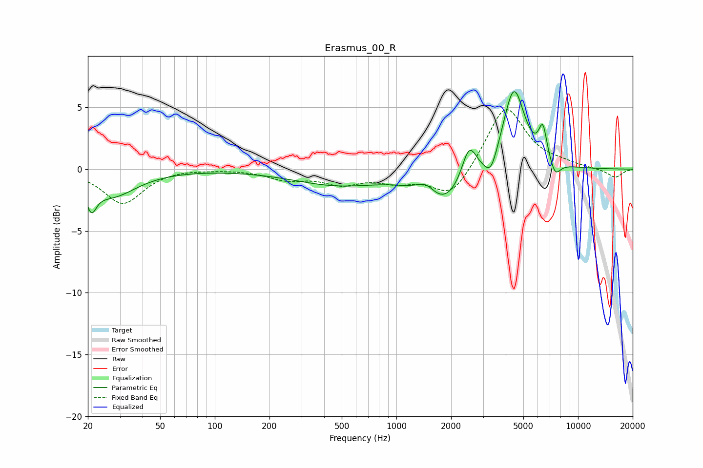

# Erasmus_00_R
See [usage instructions](https://github.com/jaakkopasanen/AutoEq#usage) for more options and info.

### Parametric EQs
Apply preamp of -6.4 dB when using parametric equalizer.

|   # | Type    |   Fc (Hz) |    Q |   Gain (dB) |
|-----|---------|-----------|------|-------------|
|   1 | Peaking |        21 | 5.33 |        -1.9 |
|   2 | Peaking |        27 | 1.03 |        -2.1 |
|   3 | Peaking |       471 | 0.58 |        -1.2 |
|   4 | Peaking |      1459 | 2.62 |         1.1 |
|   5 | Peaking |      1814 | 1.12 |        -3   |
|   6 | Peaking |      2513 | 3.43 |         2.9 |
|   7 | Peaking |      3308 | 4.01 |        -1.6 |
|   8 | Peaking |      4432 | 2.31 |         6.8 |
|   9 | Peaking |      6402 | 5.96 |         2.6 |
|  10 | Peaking |      7479 | 4.56 |        -1.3 |

### Fixed Band EQs
When using fixed band (also called graphic) equalizer, apply preamp of **-4.9 dB** (if available) and set gains manually with these parameters.

|   # | Type    |   Fc (Hz) |    Q |   Gain (dB) |
|-----|---------|-----------|------|-------------|
|   1 | Peaking |        31 | 1.41 |        -2.8 |
|   2 | Peaking |        62 | 1.41 |         0.1 |
|   3 | Peaking |       125 | 1.41 |         0   |
|   4 | Peaking |       250 | 1.41 |        -0.8 |
|   5 | Peaking |       500 | 1.41 |        -1.1 |
|   6 | Peaking |      1000 | 1.41 |        -0.9 |
|   7 | Peaking |      2000 | 1.41 |        -2.4 |
|   8 | Peaking |      4000 | 1.41 |         5.2 |
|   9 | Peaking |      8000 | 1.41 |         0.3 |
|  10 | Peaking |     16000 | 1.41 |        -0.7 |

### Graphs

