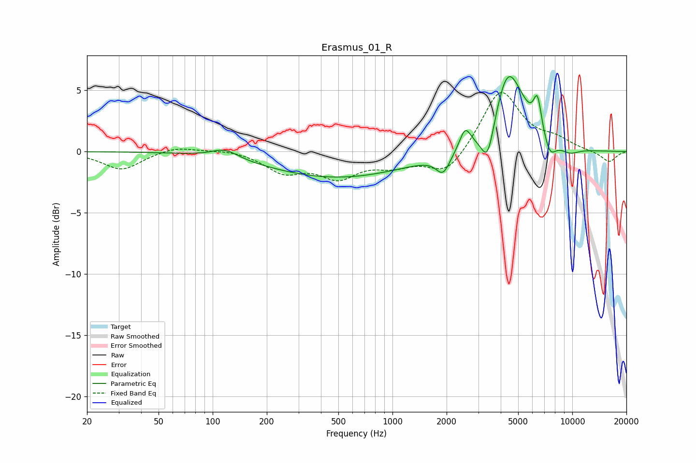

# Erasmus_01_R
See [usage instructions](https://github.com/jaakkopasanen/AutoEq#usage) for more options and info.

### Parametric EQs
Apply preamp of -6.2 dB when using parametric equalizer.

|   # | Type    |   Fc (Hz) |    Q |   Gain (dB) |
|-----|---------|-----------|------|-------------|
|   1 | Peaking |       117 | 1.92 |         0.8 |
|   2 | Peaking |       494 | 0.37 |        -2.1 |
|   3 | Peaking |      1913 | 3.66 |        -1.5 |
|   4 | Peaking |      2535 | 4.47 |         1.8 |
|   5 | Peaking |      3385 | 3.89 |        -3   |
|   6 | Peaking |      4373 | 1.83 |         6.3 |
|   7 | Peaking |      5344 | 2.18 |         0.8 |
|   8 | Peaking |      6406 | 5.99 |         2.8 |
|   9 | Peaking |      7508 | 4.2  |        -1.3 |
|  10 | Peaking |      9716 | 2.59 |        -0.5 |

### Fixed Band EQs
When using fixed band (also called graphic) equalizer, apply preamp of **-4.9 dB** (if available) and set gains manually with these parameters.

|   # | Type    |   Fc (Hz) |    Q |   Gain (dB) |
|-----|---------|-----------|------|-------------|
|   1 | Peaking |        31 | 1.41 |        -1.5 |
|   2 | Peaking |        62 | 1.41 |         0.5 |
|   3 | Peaking |       125 | 1.41 |         0.2 |
|   4 | Peaking |       250 | 1.41 |        -1.6 |
|   5 | Peaking |       500 | 1.41 |        -1.9 |
|   6 | Peaking |      1000 | 1.41 |        -1   |
|   7 | Peaking |      2000 | 1.41 |        -1.9 |
|   8 | Peaking |      4000 | 1.41 |         5.1 |
|   9 | Peaking |      8000 | 1.41 |         0.8 |
|  10 | Peaking |     16000 | 1.41 |        -0.9 |

### Graphs

