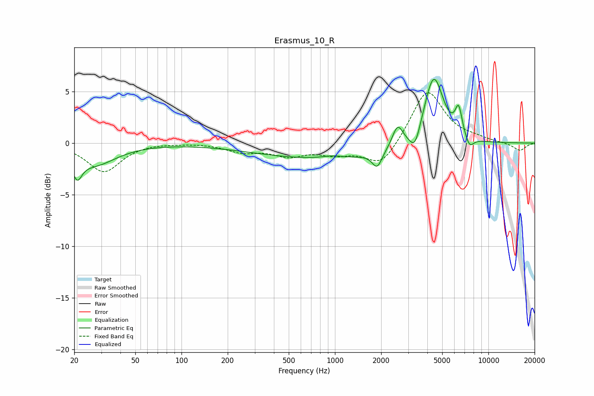

# Erasmus_10_R
See [usage instructions](https://github.com/jaakkopasanen/AutoEq#usage) for more options and info.

### Parametric EQs
Apply preamp of -6.3 dB when using parametric equalizer.

|   # | Type    |   Fc (Hz) |    Q |   Gain (dB) |
|-----|---------|-----------|------|-------------|
|   1 | Peaking |        21 | 4.72 |        -2   |
|   2 | Peaking |        27 | 0.99 |        -2   |
|   3 | Peaking |       954 | 0.27 |        -1.5 |
|   4 | Peaking |       955 | 2.28 |         0.2 |
|   5 | Peaking |      1884 | 4.51 |        -1.5 |
|   6 | Peaking |      2560 | 4.04 |         2.1 |
|   7 | Peaking |      3323 | 4.14 |        -1.9 |
|   8 | Peaking |      4399 | 2.17 |         6.9 |
|   9 | Peaking |      6401 | 5.98 |         2.6 |
|  10 | Peaking |      7524 | 4.72 |        -1.1 |

### Fixed Band EQs
When using fixed band (also called graphic) equalizer, apply preamp of **-5.0 dB** (if available) and set gains manually with these parameters.

|   # | Type    |   Fc (Hz) |    Q |   Gain (dB) |
|-----|---------|-----------|------|-------------|
|   1 | Peaking |        31 | 1.41 |        -2.8 |
|   2 | Peaking |        62 | 1.41 |         0.1 |
|   3 | Peaking |       125 | 1.41 |         0.1 |
|   4 | Peaking |       250 | 1.41 |        -0.8 |
|   5 | Peaking |       500 | 1.41 |        -1.1 |
|   6 | Peaking |      1000 | 1.41 |        -0.9 |
|   7 | Peaking |      2000 | 1.41 |        -2.3 |
|   8 | Peaking |      4000 | 1.41 |         5.3 |
|   9 | Peaking |      8000 | 1.41 |         0.3 |
|  10 | Peaking |     16000 | 1.41 |        -0.8 |

### Graphs

