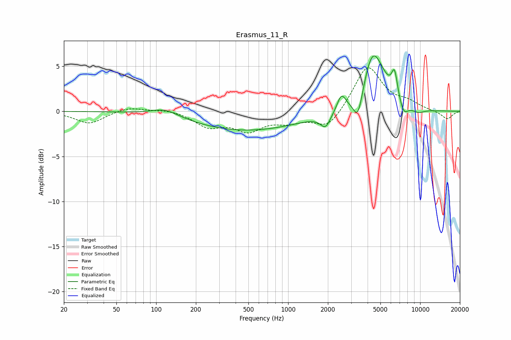

# Erasmus_11_R
See [usage instructions](https://github.com/jaakkopasanen/AutoEq#usage) for more options and info.

### Parametric EQs
Apply preamp of -6.2 dB when using parametric equalizer.

|   # | Type    |   Fc (Hz) |    Q |   Gain (dB) |
|-----|---------|-----------|------|-------------|
|   1 | Peaking |       117 | 1.34 |         0.9 |
|   2 | Peaking |       480 | 0.34 |        -2.1 |
|   3 | Peaking |      1921 | 3.65 |        -1.5 |
|   4 | Peaking |      2531 | 4.33 |         1.8 |
|   5 | Peaking |      3383 | 3.89 |        -3.1 |
|   6 | Peaking |      4365 | 1.85 |         6.3 |
|   7 | Peaking |      5348 | 2.06 |         0.9 |
|   8 | Peaking |      6397 | 5.98 |         2.9 |
|   9 | Peaking |      7505 | 4.19 |        -1.3 |
|  10 | Peaking |      9680 | 2.58 |        -0.5 |

### Fixed Band EQs
When using fixed band (also called graphic) equalizer, apply preamp of **-4.9 dB** (if available) and set gains manually with these parameters.

|   # | Type    |   Fc (Hz) |    Q |   Gain (dB) |
|-----|---------|-----------|------|-------------|
|   1 | Peaking |        31 | 1.41 |        -1.4 |
|   2 | Peaking |        62 | 1.41 |         0.5 |
|   3 | Peaking |       125 | 1.41 |         0.3 |
|   4 | Peaking |       250 | 1.41 |        -1.6 |
|   5 | Peaking |       500 | 1.41 |        -1.9 |
|   6 | Peaking |      1000 | 1.41 |        -1   |
|   7 | Peaking |      2000 | 1.41 |        -2   |
|   8 | Peaking |      4000 | 1.41 |         5.1 |
|   9 | Peaking |      8000 | 1.41 |         0.8 |
|  10 | Peaking |     16000 | 1.41 |        -0.9 |

### Graphs

