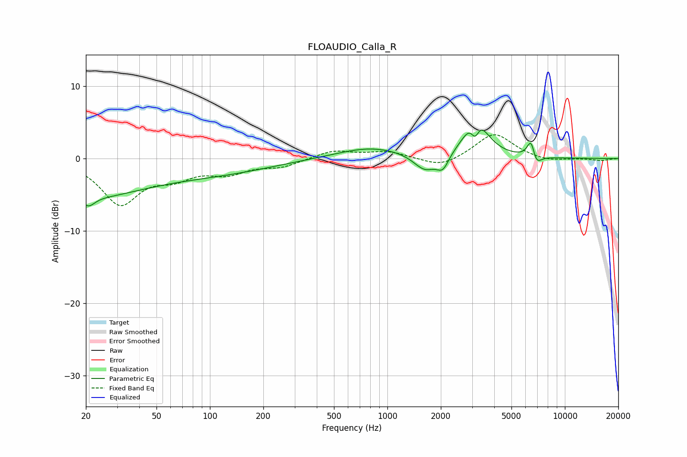

# FLOAUDIO_Calla_R
See [usage instructions](https://github.com/jaakkopasanen/AutoEq#usage) for more options and info.

### Parametric EQs
Apply preamp of -4.0 dB when using parametric equalizer.

|   # | Type    |   Fc (Hz) |    Q |   Gain (dB) |
|-----|---------|-----------|------|-------------|
|   1 | Peaking |        20 | 0.41 |        -5   |
|   2 | Peaking |        21 | 4.16 |        -1.3 |
|   3 | Peaking |       113 | 0.46 |        -1.7 |
|   4 | Peaking |       811 | 0.72 |         1.6 |
|   5 | Peaking |      1628 | 2.21 |        -2.3 |
|   6 | Peaking |      2053 | 4.21 |        -2   |
|   7 | Peaking |      3121 | 5.96 |        -2.9 |
|   8 | Peaking |      3142 | 2.26 |         6.2 |
|   9 | Peaking |      6470 | 6    |         3.1 |
|  10 | Peaking |      6826 | 4.91 |        -2.1 |

### Fixed Band EQs
When using fixed band (also called graphic) equalizer, apply preamp of **-3.4 dB** (if available) and set gains manually with these parameters.

|   # | Type    |   Fc (Hz) |    Q |   Gain (dB) |
|-----|---------|-----------|------|-------------|
|   1 | Peaking |        31 | 1.41 |        -6.1 |
|   2 | Peaking |        62 | 1.41 |        -2.1 |
|   3 | Peaking |       125 | 1.41 |        -1.8 |
|   4 | Peaking |       250 | 1.41 |        -1   |
|   5 | Peaking |       500 | 1.41 |         1.1 |
|   6 | Peaking |      1000 | 1.41 |         0.9 |
|   7 | Peaking |      2000 | 1.41 |        -1.3 |
|   8 | Peaking |      4000 | 1.41 |         3.5 |
|   9 | Peaking |      8000 | 1.41 |        -0.5 |
|  10 | Peaking |     16000 | 1.41 |        -0.3 |

### Graphs

