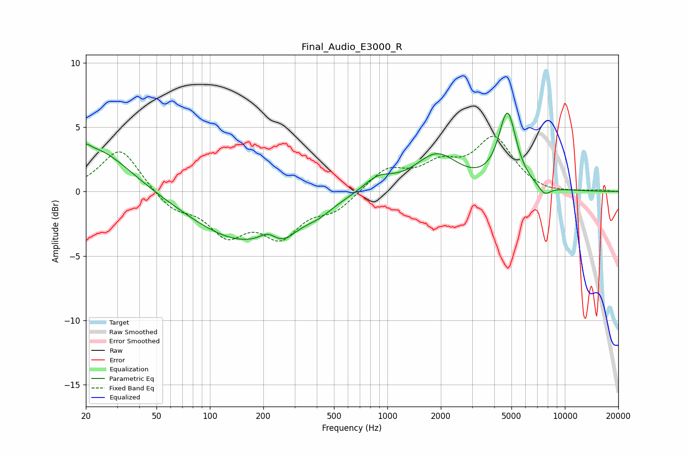

# Final_Audio_E3000_R
See [usage instructions](https://github.com/jaakkopasanen/AutoEq#usage) for more options and info.

### Parametric EQs
Apply preamp of -6.2 dB when using parametric equalizer.

|   # | Type    |   Fc (Hz) |    Q |   Gain (dB) |
|-----|---------|-----------|------|-------------|
|   1 | Peaking |        20 | 5.8  |         0.5 |
|   2 | Peaking |        22 | 0.72 |         3.6 |
|   3 | Peaking |       151 | 0.49 |        -3.8 |
|   4 | Peaking |       213 | 2.91 |         0.8 |
|   5 | Peaking |       255 | 1.77 |        -1.1 |
|   6 | Peaking |       411 | 2.01 |        -0.5 |
|   7 | Peaking |       883 | 1.65 |         1.1 |
|   8 | Peaking |      1895 | 1.17 |         2.8 |
|   9 | Peaking |      4748 | 2.83 |         5.8 |
|  10 | Peaking |      7680 | 3.76 |        -0.7 |

### Fixed Band EQs
When using fixed band (also called graphic) equalizer, apply preamp of **-4.4 dB** (if available) and set gains manually with these parameters.

|   # | Type    |   Fc (Hz) |    Q |   Gain (dB) |
|-----|---------|-----------|------|-------------|
|   1 | Peaking |        31 | 1.41 |         3.4 |
|   2 | Peaking |        62 | 1.41 |        -1.3 |
|   3 | Peaking |       125 | 1.41 |        -3   |
|   4 | Peaking |       250 | 1.41 |        -3.1 |
|   5 | Peaking |       500 | 1.41 |        -1.3 |
|   6 | Peaking |      1000 | 1.41 |         1.7 |
|   7 | Peaking |      2000 | 1.41 |         1.8 |
|   8 | Peaking |      4000 | 1.41 |         4   |
|   9 | Peaking |      8000 | 1.41 |        -0.2 |
|  10 | Peaking |     16000 | 1.41 |         0.1 |

### Graphs

