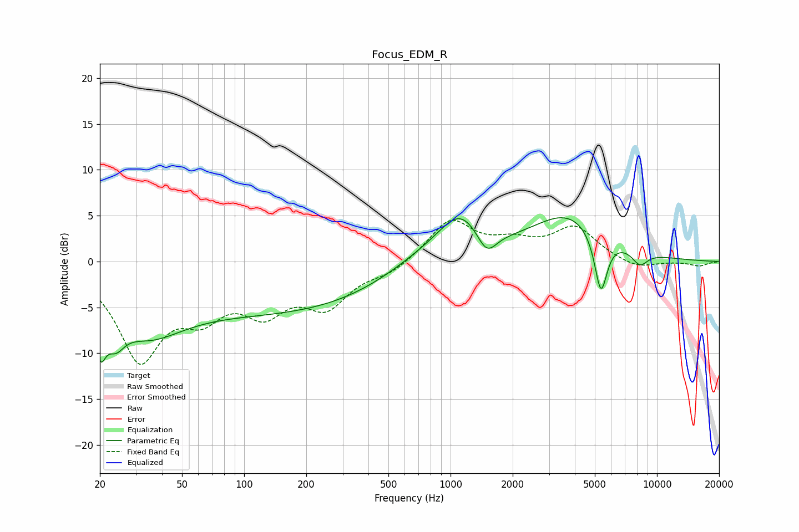

# Focus_EDM_R
See [usage instructions](https://github.com/jaakkopasanen/AutoEq#usage) for more options and info.

### Parametric EQs
Apply preamp of -4.9 dB when using parametric equalizer.

|   # | Type    |   Fc (Hz) |    Q |   Gain (dB) |
|-----|---------|-----------|------|-------------|
|   1 | Peaking |        20 | 5.34 |        -4.9 |
|   2 | Peaking |        24 | 3.15 |        -3   |
|   3 | Peaking |        33 | 0.77 |        -5.5 |
|   4 | Peaking |       165 | 0.23 |        -5.4 |
|   5 | Peaking |       753 | 0.61 |         2.4 |
|   6 | Peaking |      1116 | 1.35 |         4.3 |
|   7 | Peaking |      1495 | 2.89 |        -2.7 |
|   8 | Peaking |      3740 | 0.76 |         5   |
|   9 | Peaking |      5351 | 4.45 |        -6.6 |
|  10 | Peaking |      8261 | 3.4  |        -1.6 |

### Fixed Band EQs
When using fixed band (also called graphic) equalizer, apply preamp of **-4.6 dB** (if available) and set gains manually with these parameters.

|   # | Type    |   Fc (Hz) |    Q |   Gain (dB) |
|-----|---------|-----------|------|-------------|
|   1 | Peaking |        31 | 1.41 |       -10.2 |
|   2 | Peaking |        62 | 1.41 |        -4.3 |
|   3 | Peaking |       125 | 1.41 |        -4.6 |
|   4 | Peaking |       250 | 1.41 |        -4.4 |
|   5 | Peaking |       500 | 1.41 |        -1.1 |
|   6 | Peaking |      1000 | 1.41 |         4.5 |
|   7 | Peaking |      2000 | 1.41 |         1.7 |
|   8 | Peaking |      4000 | 1.41 |         3.6 |
|   9 | Peaking |      8000 | 1.41 |        -0.9 |
|  10 | Peaking |     16000 | 1.41 |        -0.5 |

### Graphs

