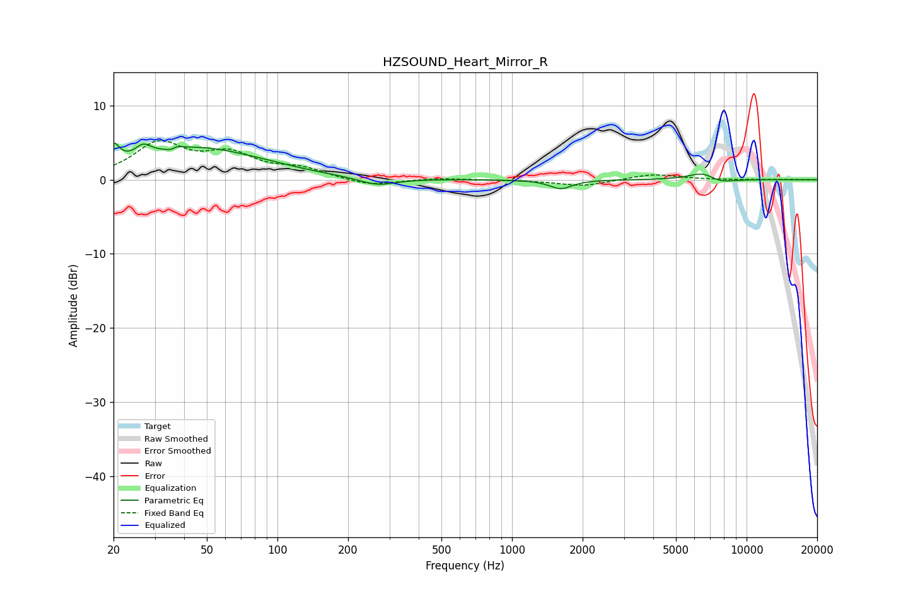

# HZSOUND_Heart_Mirror_R
See [usage instructions](https://github.com/jaakkopasanen/AutoEq#usage) for more options and info.

### Parametric EQs
Apply preamp of -5.0 dB when using parametric equalizer.

|   # | Type    |   Fc (Hz) |    Q |   Gain (dB) |
|-----|---------|-----------|------|-------------|
|   1 | Peaking |        20 | 5.91 |         2.5 |
|   2 | Peaking |        27 | 4.39 |         1.4 |
|   3 | Peaking |        36 | 6    |        -3   |
|   4 | Peaking |        36 | 5.96 |         3   |
|   5 | Peaking |        45 | 0.53 |         4.2 |
|   6 | Peaking |        96 | 1.79 |         0.1 |
|   7 | Peaking |       266 | 1.8  |        -1   |
|   8 | Peaking |      1613 | 2.95 |        -1.2 |
|   9 | Peaking |      6601 | 2.18 |         1.3 |
|  10 | Peaking |      7492 | 2.13 |        -0.9 |

### Fixed Band EQs
When using fixed band (also called graphic) equalizer, apply preamp of **-5.4 dB** (if available) and set gains manually with these parameters.

|   # | Type    |   Fc (Hz) |    Q |   Gain (dB) |
|-----|---------|-----------|------|-------------|
|   1 | Peaking |        31 | 1.41 |         4.7 |
|   2 | Peaking |        62 | 1.41 |         3   |
|   3 | Peaking |       125 | 1.41 |         1.3 |
|   4 | Peaking |       250 | 1.41 |        -0.9 |
|   5 | Peaking |       500 | 1.41 |         0.2 |
|   6 | Peaking |      1000 | 1.41 |        -0.1 |
|   7 | Peaking |      2000 | 1.41 |        -0.9 |
|   8 | Peaking |      4000 | 1.41 |         0.8 |
|   9 | Peaking |      8000 | 1.41 |        -0   |
|  10 | Peaking |     16000 | 1.41 |         0   |

### Graphs

