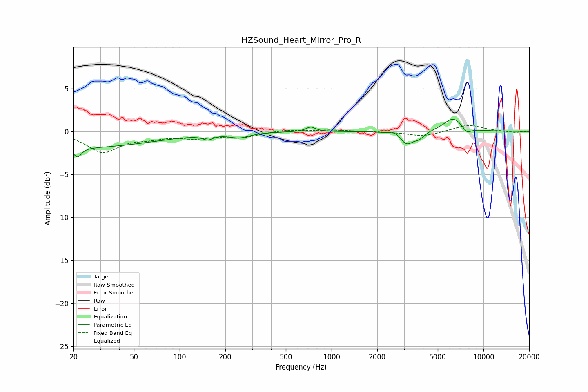

# HZSound_Heart_Mirror_Pro_R
See [usage instructions](https://github.com/jaakkopasanen/AutoEq#usage) for more options and info.

### Parametric EQs
Apply preamp of -1.5 dB when using parametric equalizer.

|   # | Type    |   Fc (Hz) |    Q |   Gain (dB) |
|-----|---------|-----------|------|-------------|
|   1 | Peaking |        20 | 0.26 |        -1.9 |
|   2 | Peaking |        21 | 5.76 |        -1.1 |
|   3 | Peaking |       153 | 4.6  |        -0.5 |
|   4 | Peaking |       247 | 2.2  |        -0.6 |
|   5 | Peaking |       729 | 4.75 |         0.5 |
|   6 | Peaking |      2631 | 4.89 |         0.3 |
|   7 | Peaking |      3125 | 3.27 |        -1.5 |
|   8 | Peaking |      3779 | 4.16 |        -0.7 |
|   9 | Peaking |      6326 | 2.17 |         1.6 |
|  10 | Peaking |      7773 | 4.47 |        -0.7 |

### Fixed Band EQs
When using fixed band (also called graphic) equalizer, apply preamp of **-0.8 dB** (if available) and set gains manually with these parameters.

|   # | Type    |   Fc (Hz) |    Q |   Gain (dB) |
|-----|---------|-----------|------|-------------|
|   1 | Peaking |        31 | 1.41 |        -2.3 |
|   2 | Peaking |        62 | 1.41 |        -0.6 |
|   3 | Peaking |       125 | 1.41 |        -0.6 |
|   4 | Peaking |       250 | 1.41 |        -0.7 |
|   5 | Peaking |       500 | 1.41 |         0.2 |
|   6 | Peaking |      1000 | 1.41 |         0.2 |
|   7 | Peaking |      2000 | 1.41 |        -0   |
|   8 | Peaking |      4000 | 1.41 |        -0.6 |
|   9 | Peaking |      8000 | 1.41 |         0.8 |
|  10 | Peaking |     16000 | 1.41 |        -0.1 |

### Graphs

