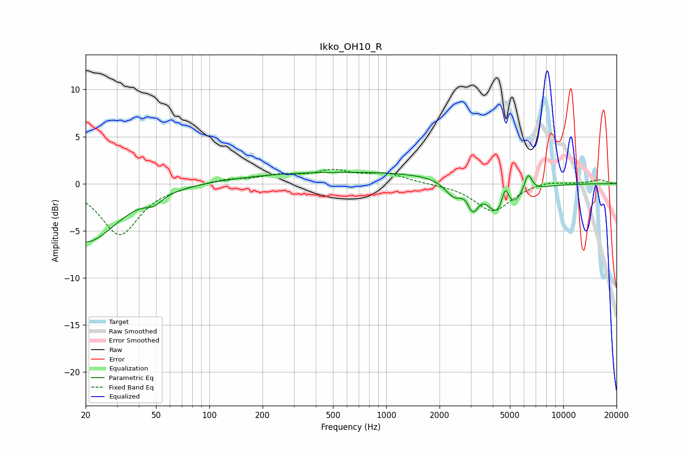

# Ikko_OH10_R
See [usage instructions](https://github.com/jaakkopasanen/AutoEq#usage) for more options and info.

### Parametric EQs
Apply preamp of -1.3 dB when using parametric equalizer.

|   # | Type    |   Fc (Hz) |    Q |   Gain (dB) |
|-----|---------|-----------|------|-------------|
|   1 | Peaking |        20 | 0.81 |        -6.2 |
|   2 | Peaking |        49 | 3.15 |        -0.8 |
|   3 | Peaking |       690 | 0.18 |         1.3 |
|   4 | Peaking |      2410 | 2.84 |        -1.7 |
|   5 | Peaking |      3035 | 5.83 |        -1.5 |
|   6 | Peaking |      3205 | 5.9  |        -1   |
|   7 | Peaking |      3308 | 2.24 |         0.6 |
|   8 | Peaking |      4497 | 1.71 |        -4.7 |
|   9 | Peaking |      4707 | 6    |         3.2 |
|  10 | Peaking |      6330 | 6    |         2.1 |

### Fixed Band EQs
When using fixed band (also called graphic) equalizer, apply preamp of **-1.6 dB** (if available) and set gains manually with these parameters.

|   # | Type    |   Fc (Hz) |    Q |   Gain (dB) |
|-----|---------|-----------|------|-------------|
|   1 | Peaking |        31 | 1.41 |        -5.4 |
|   2 | Peaking |        62 | 1.41 |        -0.1 |
|   3 | Peaking |       125 | 1.41 |         0.5 |
|   4 | Peaking |       250 | 1.41 |         0.8 |
|   5 | Peaking |       500 | 1.41 |         1.2 |
|   6 | Peaking |      1000 | 1.41 |         1   |
|   7 | Peaking |      2000 | 1.41 |        -0   |
|   8 | Peaking |      4000 | 1.41 |        -3   |
|   9 | Peaking |      8000 | 1.41 |         0.4 |
|  10 | Peaking |     16000 | 1.41 |         0.4 |

### Graphs

