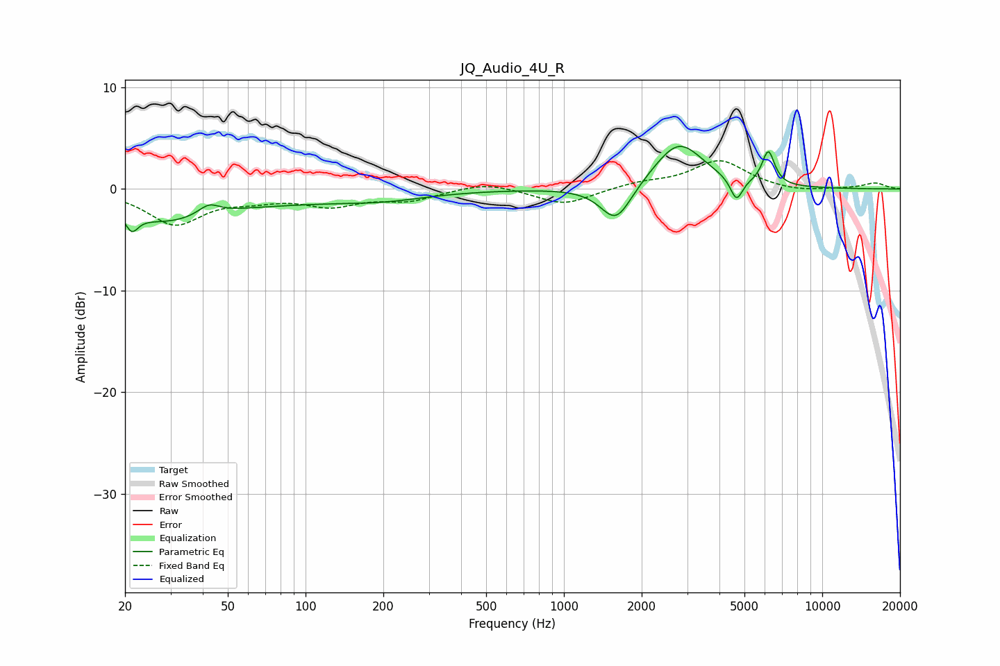

# JQ_Audio_4U_R
See [usage instructions](https://github.com/jaakkopasanen/AutoEq#usage) for more options and info.

### Parametric EQs
Apply preamp of -4.3 dB when using parametric equalizer.

|   # | Type    |   Fc (Hz) |    Q |   Gain (dB) |
|-----|---------|-----------|------|-------------|
|   1 | Peaking |        21 | 6    |         2.2 |
|   2 | Peaking |        21 | 5.86 |        -4   |
|   3 | Peaking |        28 | 0.84 |        -2.6 |
|   4 | Peaking |        42 | 3.54 |         1   |
|   5 | Peaking |        79 | 0.4  |        -1.1 |
|   6 | Peaking |       205 | 0.88 |        -0.6 |
|   7 | Peaking |      1592 | 2.35 |        -3.7 |
|   8 | Peaking |      2785 | 1.47 |         4.6 |
|   9 | Peaking |      4655 | 5.99 |        -2.3 |
|  10 | Peaking |      6184 | 5.72 |         3.3 |

### Fixed Band EQs
When using fixed band (also called graphic) equalizer, apply preamp of **-2.9 dB** (if available) and set gains manually with these parameters.

|   # | Type    |   Fc (Hz) |    Q |   Gain (dB) |
|-----|---------|-----------|------|-------------|
|   1 | Peaking |        31 | 1.41 |        -3.4 |
|   2 | Peaking |        62 | 1.41 |        -0.8 |
|   3 | Peaking |       125 | 1.41 |        -1.5 |
|   4 | Peaking |       250 | 1.41 |        -1   |
|   5 | Peaking |       500 | 1.41 |         0.7 |
|   6 | Peaking |      1000 | 1.41 |        -1.6 |
|   7 | Peaking |      2000 | 1.41 |         0.6 |
|   8 | Peaking |      4000 | 1.41 |         2.8 |
|   9 | Peaking |      8000 | 1.41 |        -0.3 |
|  10 | Peaking |     16000 | 1.41 |         0.6 |

### Graphs

