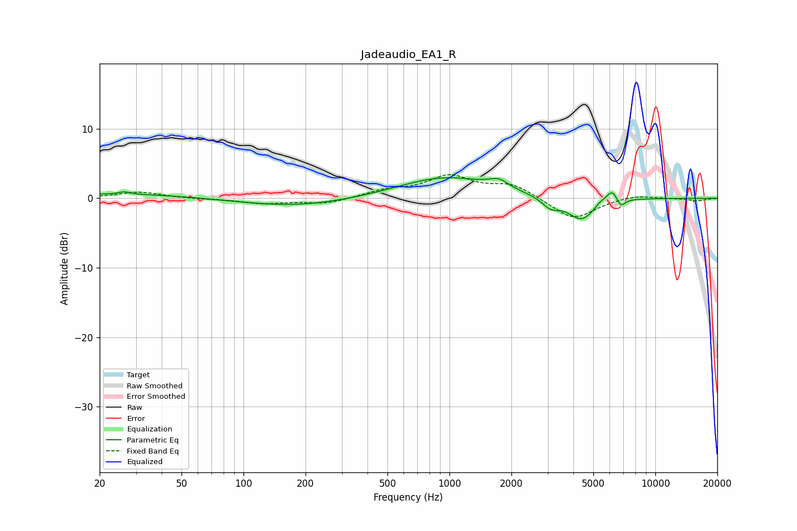

# Jadeaudio_EA1_R
See [usage instructions](https://github.com/jaakkopasanen/AutoEq#usage) for more options and info.

### Parametric EQs
Apply preamp of -3.1 dB when using parametric equalizer.

|   # | Type    |   Fc (Hz) |    Q |   Gain (dB) |
|-----|---------|-----------|------|-------------|
|   1 | Peaking |        26 | 0.37 |         0.7 |
|   2 | Peaking |        26 | 5.67 |         0.4 |
|   3 | Peaking |       177 | 0.51 |        -1.2 |
|   4 | Peaking |       957 | 0.62 |         3.1 |
|   5 | Peaking |      1738 | 3.06 |         1.2 |
|   6 | Peaking |      3097 | 3.34 |        -1.4 |
|   7 | Peaking |      4390 | 2.05 |        -3.3 |
|   8 | Peaking |      5330 | 5.87 |         0.5 |
|   9 | Peaking |      6187 | 4.29 |         2.1 |
|  10 | Peaking |      6771 | 6    |        -1.5 |

### Fixed Band EQs
When using fixed band (also called graphic) equalizer, apply preamp of **-3.5 dB** (if available) and set gains manually with these parameters.

|   # | Type    |   Fc (Hz) |    Q |   Gain (dB) |
|-----|---------|-----------|------|-------------|
|   1 | Peaking |        31 | 1.41 |         0.9 |
|   2 | Peaking |        62 | 1.41 |        -0.1 |
|   3 | Peaking |       125 | 1.41 |        -0.7 |
|   4 | Peaking |       250 | 1.41 |        -0.8 |
|   5 | Peaking |       500 | 1.41 |         1   |
|   6 | Peaking |      1000 | 1.41 |         3   |
|   7 | Peaking |      2000 | 1.41 |         1.9 |
|   8 | Peaking |      4000 | 1.41 |        -3.1 |
|   9 | Peaking |      8000 | 1.41 |         0.5 |
|  10 | Peaking |     16000 | 1.41 |        -0.4 |

### Graphs

