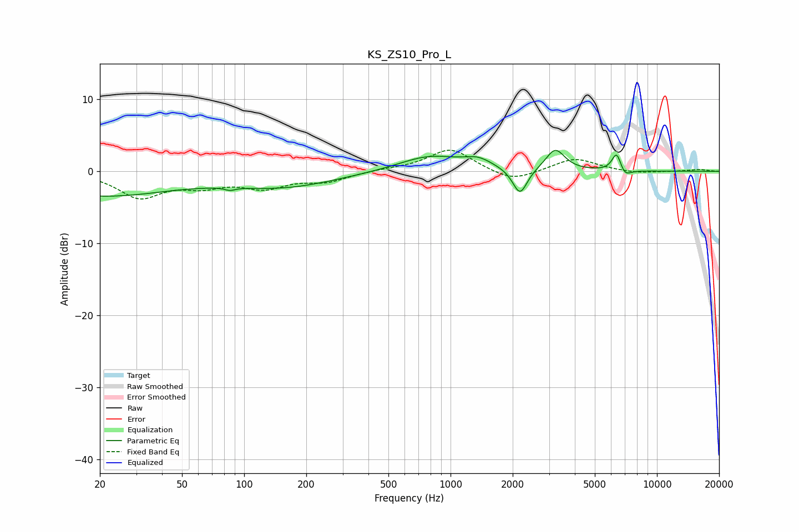

# KS_ZS10_Pro_L
See [usage instructions](https://github.com/jaakkopasanen/AutoEq#usage) for more options and info.

### Parametric EQs
Apply preamp of -3.0 dB when using parametric equalizer.

|   # | Type    |   Fc (Hz) |    Q |   Gain (dB) |
|-----|---------|-----------|------|-------------|
|   1 | Peaking |        20 | 0.39 |        -3.3 |
|   2 | Peaking |        87 | 5.9  |        -2.3 |
|   3 | Peaking |        87 | 5.97 |         1.9 |
|   4 | Peaking |       156 | 0.57 |        -2   |
|   5 | Peaking |       788 | 0.95 |         2.1 |
|   6 | Peaking |      1359 | 2.06 |         1.2 |
|   7 | Peaking |      2170 | 4    |        -3.7 |
|   8 | Peaking |      3217 | 3.1  |         3   |
|   9 | Peaking |      6382 | 5.99 |         2.7 |
|  10 | Peaking |      6955 | 4.81 |        -1.2 |

### Fixed Band EQs
When using fixed band (also called graphic) equalizer, apply preamp of **-3.0 dB** (if available) and set gains manually with these parameters.

|   # | Type    |   Fc (Hz) |    Q |   Gain (dB) |
|-----|---------|-----------|------|-------------|
|   1 | Peaking |        31 | 1.41 |        -3.5 |
|   2 | Peaking |        62 | 1.41 |        -1.7 |
|   3 | Peaking |       125 | 1.41 |        -2   |
|   4 | Peaking |       250 | 1.41 |        -1.3 |
|   5 | Peaking |       500 | 1.41 |         0.2 |
|   6 | Peaking |      1000 | 1.41 |         3.2 |
|   7 | Peaking |      2000 | 1.41 |        -1.6 |
|   8 | Peaking |      4000 | 1.41 |         1.8 |
|   9 | Peaking |      8000 | 1.41 |        -0.3 |
|  10 | Peaking |     16000 | 1.41 |         0.2 |

### Graphs

