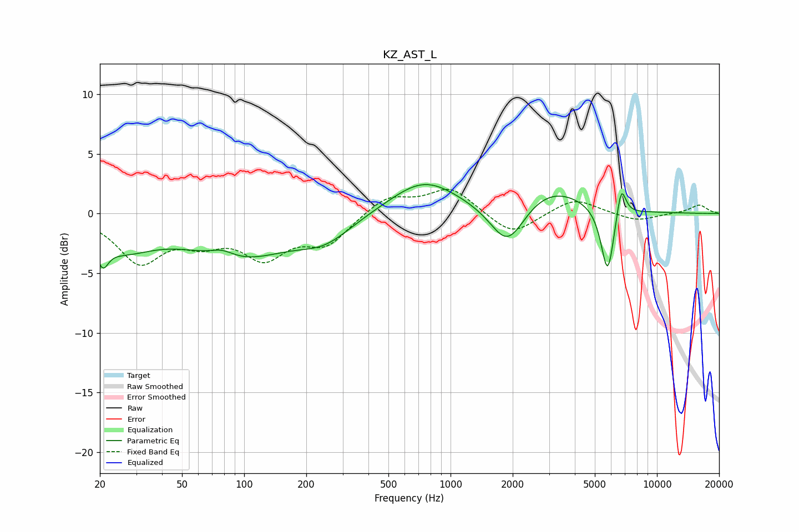

# KZ_AST_L
See [usage instructions](https://github.com/jaakkopasanen/AutoEq#usage) for more options and info.

### Parametric EQs
Apply preamp of -2.5 dB when using parametric equalizer.

|   # | Type    |   Fc (Hz) |    Q |   Gain (dB) |
|-----|---------|-----------|------|-------------|
|   1 | Peaking |        21 | 5.41 |        -1.8 |
|   2 | Peaking |        25 | 0.89 |        -2.5 |
|   3 | Peaking |        78 | 2.37 |         0.7 |
|   4 | Peaking |        96 | 0.57 |        -3.5 |
|   5 | Peaking |       247 | 1.11 |        -1.7 |
|   6 | Peaking |       743 | 0.86 |         2.9 |
|   7 | Peaking |      1890 | 1.68 |        -3.8 |
|   8 | Peaking |      3033 | 0.83 |         2.3 |
|   9 | Peaking |      5768 | 4.36 |        -5.7 |
|  10 | Peaking |      6709 | 6    |         2.8 |

### Fixed Band EQs
When using fixed band (also called graphic) equalizer, apply preamp of **-2.1 dB** (if available) and set gains manually with these parameters.

|   # | Type    |   Fc (Hz) |    Q |   Gain (dB) |
|-----|---------|-----------|------|-------------|
|   1 | Peaking |        31 | 1.41 |        -3.9 |
|   2 | Peaking |        62 | 1.41 |        -1.8 |
|   3 | Peaking |       125 | 1.41 |        -3.3 |
|   4 | Peaking |       250 | 1.41 |        -2.4 |
|   5 | Peaking |       500 | 1.41 |         1.5 |
|   6 | Peaking |      1000 | 1.41 |         2.1 |
|   7 | Peaking |      2000 | 1.41 |        -1.9 |
|   8 | Peaking |      4000 | 1.41 |         1.3 |
|   9 | Peaking |      8000 | 1.41 |        -0.7 |
|  10 | Peaking |     16000 | 1.41 |         0.7 |

### Graphs

