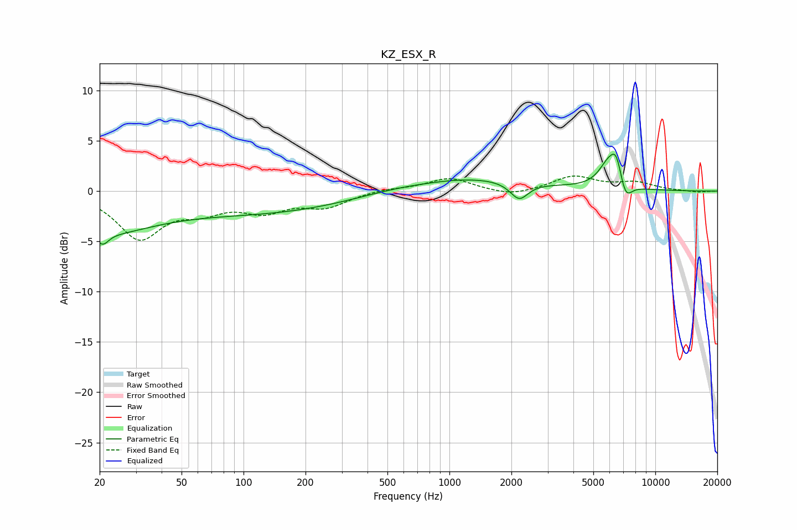

# KZ_ESX_R
See [usage instructions](https://github.com/jaakkopasanen/AutoEq#usage) for more options and info.

### Parametric EQs
Apply preamp of -3.8 dB when using parametric equalizer.

|   # | Type    |   Fc (Hz) |    Q |   Gain (dB) |
|-----|---------|-----------|------|-------------|
|   1 | Peaking |        20 | 0.56 |        -3.7 |
|   2 | Peaking |        21 | 5.11 |        -1.1 |
|   3 | Peaking |       132 | 0.3  |        -2.1 |
|   4 | Peaking |       493 | 5.83 |        -0   |
|   5 | Peaking |       801 | 0.89 |        -0.3 |
|   6 | Peaking |      1003 | 0.4  |         1.6 |
|   7 | Peaking |      2182 | 3.25 |        -1.7 |
|   8 | Peaking |      5932 | 2.83 |         2.4 |
|   9 | Peaking |      6477 | 4.93 |         2.3 |
|  10 | Peaking |      7150 | 4.46 |        -2   |

### Fixed Band EQs
When using fixed band (also called graphic) equalizer, apply preamp of **-1.6 dB** (if available) and set gains manually with these parameters.

|   # | Type    |   Fc (Hz) |    Q |   Gain (dB) |
|-----|---------|-----------|------|-------------|
|   1 | Peaking |        31 | 1.41 |        -4.5 |
|   2 | Peaking |        62 | 1.41 |        -1.6 |
|   3 | Peaking |       125 | 1.41 |        -1.7 |
|   4 | Peaking |       250 | 1.41 |        -1.4 |
|   5 | Peaking |       500 | 1.41 |         0.2 |
|   6 | Peaking |      1000 | 1.41 |         1.3 |
|   7 | Peaking |      2000 | 1.41 |        -0.6 |
|   8 | Peaking |      4000 | 1.41 |         1.4 |
|   9 | Peaking |      8000 | 1.41 |         0.8 |
|  10 | Peaking |     16000 | 1.41 |        -0.1 |

### Graphs

