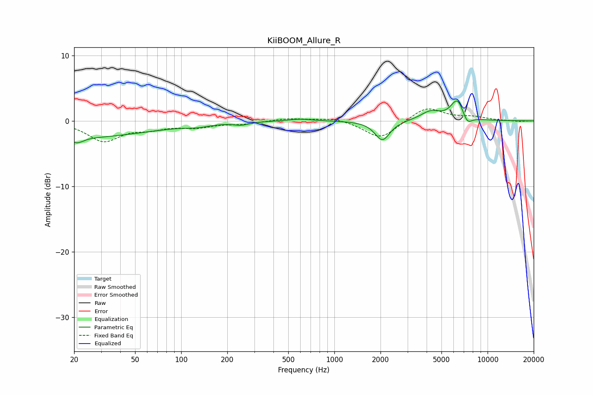

# KiiBOOM_Allure_R
See [usage instructions](https://github.com/jaakkopasanen/AutoEq#usage) for more options and info.

### Parametric EQs
Apply preamp of -3.1 dB when using parametric equalizer.

|   # | Type    |   Fc (Hz) |    Q |   Gain (dB) |
|-----|---------|-----------|------|-------------|
|   1 | Peaking |        20 | 0.28 |        -2.5 |
|   2 | Peaking |        21 | 5.11 |        -2.2 |
|   3 | Peaking |        21 | 6    |         1.4 |
|   4 | Peaking |       128 | 1.79 |        -0.4 |
|   5 | Peaking |       246 | 3.05 |        -0.4 |
|   6 | Peaking |       598 | 1.83 |         0.3 |
|   7 | Peaking |      2058 | 2.92 |        -3   |
|   8 | Peaking |      4245 | 2.14 |         1.4 |
|   9 | Peaking |      6355 | 3.15 |         3.2 |
|  10 | Peaking |      7354 | 4.36 |        -1.5 |

### Fixed Band EQs
When using fixed band (also called graphic) equalizer, apply preamp of **-1.9 dB** (if available) and set gains manually with these parameters.

|   # | Type    |   Fc (Hz) |    Q |   Gain (dB) |
|-----|---------|-----------|------|-------------|
|   1 | Peaking |        31 | 1.41 |        -3   |
|   2 | Peaking |        62 | 1.41 |        -0.9 |
|   3 | Peaking |       125 | 1.41 |        -0.8 |
|   4 | Peaking |       250 | 1.41 |        -0.4 |
|   5 | Peaking |       500 | 1.41 |         0.4 |
|   6 | Peaking |      1000 | 1.41 |         0.5 |
|   7 | Peaking |      2000 | 1.41 |        -2.8 |
|   8 | Peaking |      4000 | 1.41 |         2.2 |
|   9 | Peaking |      8000 | 1.41 |         0.5 |
|  10 | Peaking |     16000 | 1.41 |        -0.1 |

### Graphs

