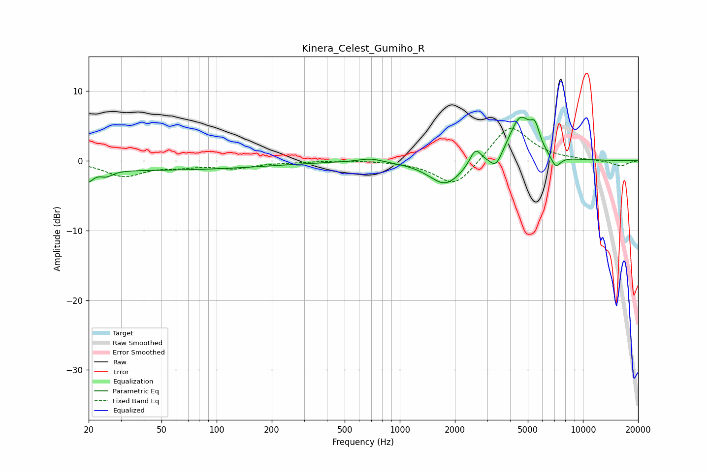

# Kinera_Celest_Gumiho_R
See [usage instructions](https://github.com/jaakkopasanen/AutoEq#usage) for more options and info.

### Parametric EQs
Apply preamp of -6.3 dB when using parametric equalizer.

|   # | Type    |   Fc (Hz) |    Q |   Gain (dB) |
|-----|---------|-----------|------|-------------|
|   1 | Peaking |        20 | 5.4  |        -1.5 |
|   2 | Peaking |        25 | 4.21 |        -0.8 |
|   3 | Peaking |        38 | 0.18 |        -1.4 |
|   4 | Peaking |       690 | 2.18 |         0.6 |
|   5 | Peaking |      1774 | 1.58 |        -3.5 |
|   6 | Peaking |      2585 | 4.72 |         2.3 |
|   7 | Peaking |      3350 | 4.31 |        -2   |
|   8 | Peaking |      4545 | 2.28 |         6.2 |
|   9 | Peaking |      5474 | 5.46 |         2.8 |
|  10 | Peaking |      7097 | 5.06 |        -1.8 |

### Fixed Band EQs
When using fixed band (also called graphic) equalizer, apply preamp of **-4.7 dB** (if available) and set gains manually with these parameters.

|   # | Type    |   Fc (Hz) |    Q |   Gain (dB) |
|-----|---------|-----------|------|-------------|
|   1 | Peaking |        31 | 1.41 |        -2.2 |
|   2 | Peaking |        62 | 1.41 |        -0.6 |
|   3 | Peaking |       125 | 1.41 |        -1   |
|   4 | Peaking |       250 | 1.41 |        -0.2 |
|   5 | Peaking |       500 | 1.41 |         0.1 |
|   6 | Peaking |      1000 | 1.41 |        -0.1 |
|   7 | Peaking |      2000 | 1.41 |        -3.9 |
|   8 | Peaking |      4000 | 1.41 |         5.3 |
|   9 | Peaking |      8000 | 1.41 |         0.1 |
|  10 | Peaking |     16000 | 1.41 |        -0.8 |

### Graphs

