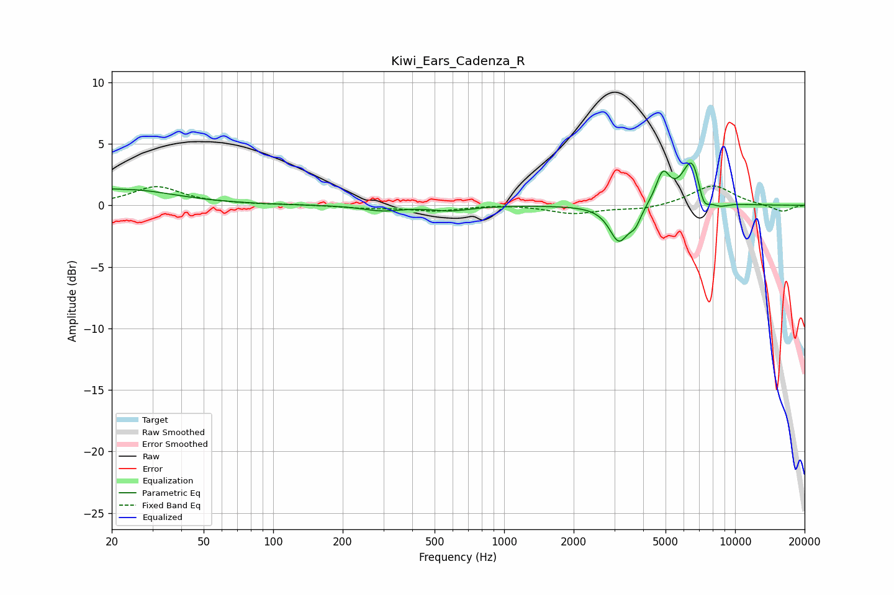

# Kiwi_Ears_Cadenza_R
See [usage instructions](https://github.com/jaakkopasanen/AutoEq#usage) for more options and info.

### Parametric EQs
Apply preamp of -3.5 dB when using parametric equalizer.

|   # | Type    |   Fc (Hz) |    Q |   Gain (dB) |
|-----|---------|-----------|------|-------------|
|   1 | Peaking |        20 | 5.74 |         0.1 |
|   2 | Peaking |        24 | 0.71 |         1.3 |
|   3 | Peaking |       296 | 1.71 |        -0.4 |
|   4 | Peaking |       588 | 1.71 |        -0.4 |
|   5 | Peaking |      3139 | 3.43 |        -2.9 |
|   6 | Peaking |      3694 | 5.46 |        -1.1 |
|   7 | Peaking |      4866 | 4.63 |         2.5 |
|   8 | Peaking |      6549 | 3.12 |         4.1 |
|   9 | Peaking |      7266 | 4.78 |        -2   |
|  10 | Peaking |      8538 | 3.26 |        -0.5 |

### Fixed Band EQs
When using fixed band (also called graphic) equalizer, apply preamp of **-1.7 dB** (if available) and set gains manually with these parameters.

|   # | Type    |   Fc (Hz) |    Q |   Gain (dB) |
|-----|---------|-----------|------|-------------|
|   1 | Peaking |        31 | 1.41 |         1.5 |
|   2 | Peaking |        62 | 1.41 |         0.1 |
|   3 | Peaking |       125 | 1.41 |         0   |
|   4 | Peaking |       250 | 1.41 |        -0.2 |
|   5 | Peaking |       500 | 1.41 |        -0.4 |
|   6 | Peaking |      1000 | 1.41 |         0.1 |
|   7 | Peaking |      2000 | 1.41 |        -0.7 |
|   8 | Peaking |      4000 | 1.41 |        -0.3 |
|   9 | Peaking |      8000 | 1.41 |         1.7 |
|  10 | Peaking |     16000 | 1.41 |        -0.6 |

### Graphs

