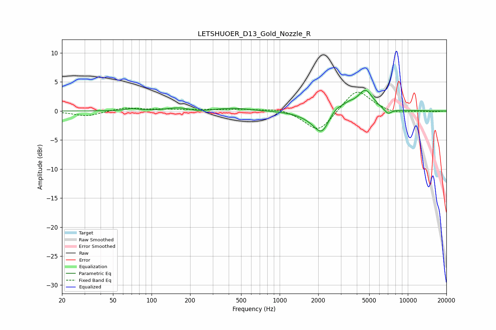

# LETSHUOER_D13_Gold_Nozzle_R
See [usage instructions](https://github.com/jaakkopasanen/AutoEq#usage) for more options and info.

### Parametric EQs
Apply preamp of -3.6 dB when using parametric equalizer.

|   # | Type    |   Fc (Hz) |    Q |   Gain (dB) |
|-----|---------|-----------|------|-------------|
|   1 | Peaking |        71 | 2.95 |         0.4 |
|   2 | Peaking |       163 | 1.64 |         0.5 |
|   3 | Peaking |       233 | 2.07 |        -0.3 |
|   4 | Peaking |       433 | 1.02 |         0.5 |
|   5 | Peaking |      1741 | 1.41 |        -0.7 |
|   6 | Peaking |      2137 | 2.33 |        -3.7 |
|   7 | Peaking |      2745 | 2.24 |         1.4 |
|   8 | Peaking |      3483 | 3.48 |         0.7 |
|   9 | Peaking |      4663 | 2.32 |         3.6 |
|  10 | Peaking |      6998 | 4.58 |        -1   |

### Fixed Band EQs
When using fixed band (also called graphic) equalizer, apply preamp of **-3.3 dB** (if available) and set gains manually with these parameters.

|   # | Type    |   Fc (Hz) |    Q |   Gain (dB) |
|-----|---------|-----------|------|-------------|
|   1 | Peaking |        31 | 1.41 |        -0.9 |
|   2 | Peaking |        62 | 1.41 |         0.6 |
|   3 | Peaking |       125 | 1.41 |         0.2 |
|   4 | Peaking |       250 | 1.41 |         0.2 |
|   5 | Peaking |       500 | 1.41 |         0.3 |
|   6 | Peaking |      1000 | 1.41 |         0.5 |
|   7 | Peaking |      2000 | 1.41 |        -3.8 |
|   8 | Peaking |      4000 | 1.41 |         3.9 |
|   9 | Peaking |      8000 | 1.41 |        -0.5 |
|  10 | Peaking |     16000 | 1.41 |        -0.1 |

### Graphs

