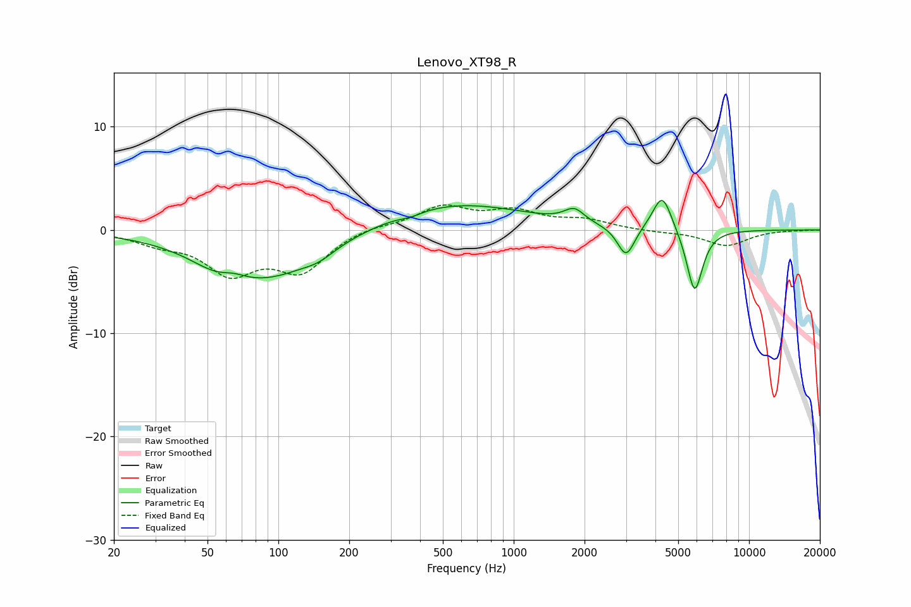

# Lenovo_XT98_R
See [usage instructions](https://github.com/jaakkopasanen/AutoEq#usage) for more options and info.

### Parametric EQs
Apply preamp of -2.9 dB when using parametric equalizer.

|   # | Type    |   Fc (Hz) |    Q |   Gain (dB) |
|-----|---------|-----------|------|-------------|
|   1 | Peaking |        55 | 1.43 |        -1   |
|   2 | Peaking |        64 | 2.66 |         0.6 |
|   3 | Peaking |        87 | 0.6  |        -4.6 |
|   4 | Peaking |       148 | 2.16 |        -0.7 |
|   5 | Peaking |       366 | 2.84 |        -0.4 |
|   6 | Peaking |       543 | 0.45 |         2.7 |
|   7 | Peaking |      1809 | 3.36 |         1.3 |
|   8 | Peaking |      3002 | 3.88 |        -3   |
|   9 | Peaking |      4278 | 3.45 |         3.7 |
|  10 | Peaking |      5871 | 4.05 |        -6.2 |

### Fixed Band EQs
When using fixed band (also called graphic) equalizer, apply preamp of **-2.5 dB** (if available) and set gains manually with these parameters.

|   # | Type    |   Fc (Hz) |    Q |   Gain (dB) |
|-----|---------|-----------|------|-------------|
|   1 | Peaking |        31 | 1.41 |        -1.1 |
|   2 | Peaking |        62 | 1.41 |        -3.8 |
|   3 | Peaking |       125 | 1.41 |        -3.7 |
|   4 | Peaking |       250 | 1.41 |         0.4 |
|   5 | Peaking |       500 | 1.41 |         2.2 |
|   6 | Peaking |      1000 | 1.41 |         1.6 |
|   7 | Peaking |      2000 | 1.41 |         0.9 |
|   8 | Peaking |      4000 | 1.41 |        -0.2 |
|   9 | Peaking |      8000 | 1.41 |        -1.5 |
|  10 | Peaking |     16000 | 1.41 |        -0   |

### Graphs

