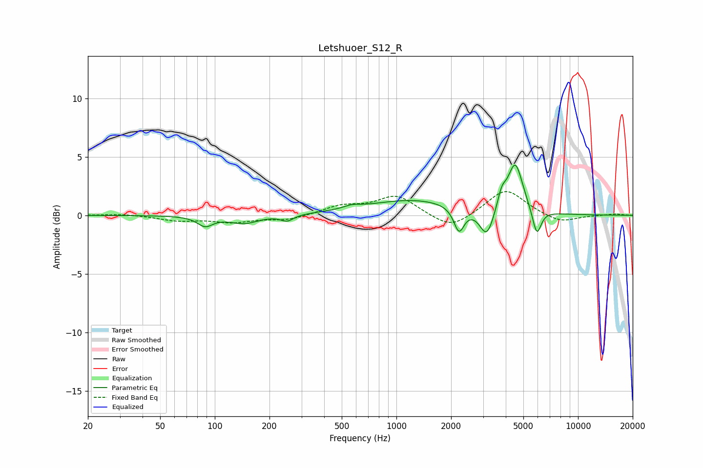

# Letshuoer_S12_R
See [usage instructions](https://github.com/jaakkopasanen/AutoEq#usage) for more options and info.

### Parametric EQs
Apply preamp of -4.4 dB when using parametric equalizer.

|   # | Type    |   Fc (Hz) |    Q |   Gain (dB) |
|-----|---------|-----------|------|-------------|
|   1 | Peaking |        89 | 3.37 |        -0.8 |
|   2 | Peaking |       145 | 1.8  |        -0.7 |
|   3 | Peaking |       250 | 4.09 |        -0.5 |
|   4 | Peaking |       570 | 3.01 |         0.3 |
|   5 | Peaking |      1243 | 0.56 |         1.3 |
|   6 | Peaking |      2212 | 5.02 |        -2.1 |
|   7 | Peaking |      3145 | 3.63 |        -2.5 |
|   8 | Peaking |      3802 | 6    |         1.3 |
|   9 | Peaking |      4512 | 3.39 |         4.3 |
|  10 | Peaking |      5930 | 5.84 |        -2.3 |

### Fixed Band EQs
When using fixed band (also called graphic) equalizer, apply preamp of **-2.1 dB** (if available) and set gains manually with these parameters.

|   # | Type    |   Fc (Hz) |    Q |   Gain (dB) |
|-----|---------|-----------|------|-------------|
|   1 | Peaking |        31 | 1.41 |         0.1 |
|   2 | Peaking |        62 | 1.41 |        -0.4 |
|   3 | Peaking |       125 | 1.41 |        -0.5 |
|   4 | Peaking |       250 | 1.41 |        -0.4 |
|   5 | Peaking |       500 | 1.41 |         0.7 |
|   6 | Peaking |      1000 | 1.41 |         1.7 |
|   7 | Peaking |      2000 | 1.41 |        -1.3 |
|   8 | Peaking |      4000 | 1.41 |         2.3 |
|   9 | Peaking |      8000 | 1.41 |        -0.7 |
|  10 | Peaking |     16000 | 1.41 |         0.1 |

### Graphs

