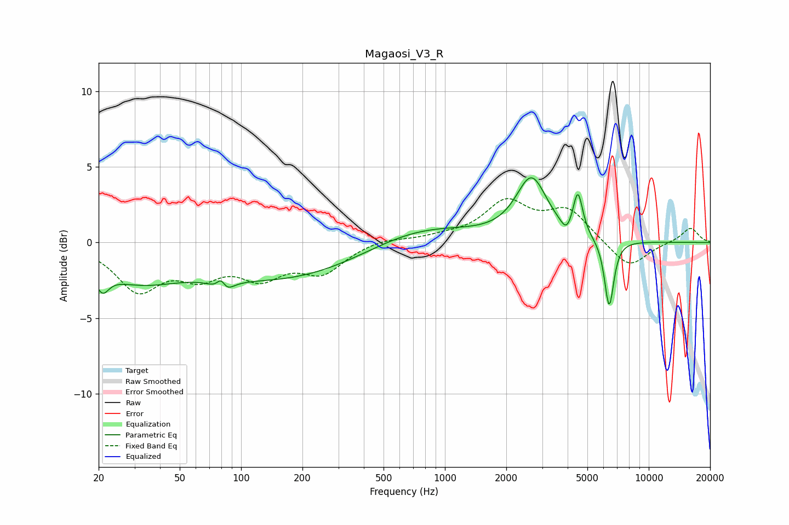

# Magaosi_V3_R
See [usage instructions](https://github.com/jaakkopasanen/AutoEq#usage) for more options and info.

### Parametric EQs
Apply preamp of -4.4 dB when using parametric equalizer.

|   # | Type    |   Fc (Hz) |    Q |   Gain (dB) |
|-----|---------|-----------|------|-------------|
|   1 | Peaking |        21 | 4.44 |        -1.3 |
|   2 | Peaking |        30 | 0.65 |        -2.2 |
|   3 | Peaking |        80 | 5.62 |         2.2 |
|   4 | Peaking |        81 | 4.2  |        -2.3 |
|   5 | Peaking |       170 | 0.34 |        -2.4 |
|   6 | Peaking |       716 | 0.52 |         1.4 |
|   7 | Peaking |      2659 | 1.88 |         4   |
|   8 | Peaking |      3950 | 5.35 |        -0.8 |
|   9 | Peaking |      4492 | 6    |         2.8 |
|  10 | Peaking |      6397 | 6    |        -4.5 |

### Fixed Band EQs
When using fixed band (also called graphic) equalizer, apply preamp of **-3.0 dB** (if available) and set gains manually with these parameters.

|   # | Type    |   Fc (Hz) |    Q |   Gain (dB) |
|-----|---------|-----------|------|-------------|
|   1 | Peaking |        31 | 1.41 |        -3   |
|   2 | Peaking |        62 | 1.41 |        -1.8 |
|   3 | Peaking |       125 | 1.41 |        -2   |
|   4 | Peaking |       250 | 1.41 |        -1.8 |
|   5 | Peaking |       500 | 1.41 |         0.3 |
|   6 | Peaking |      1000 | 1.41 |         0.3 |
|   7 | Peaking |      2000 | 1.41 |         2.5 |
|   8 | Peaking |      4000 | 1.41 |         2.1 |
|   9 | Peaking |      8000 | 1.41 |        -1.8 |
|  10 | Peaking |     16000 | 1.41 |         1   |

### Graphs

