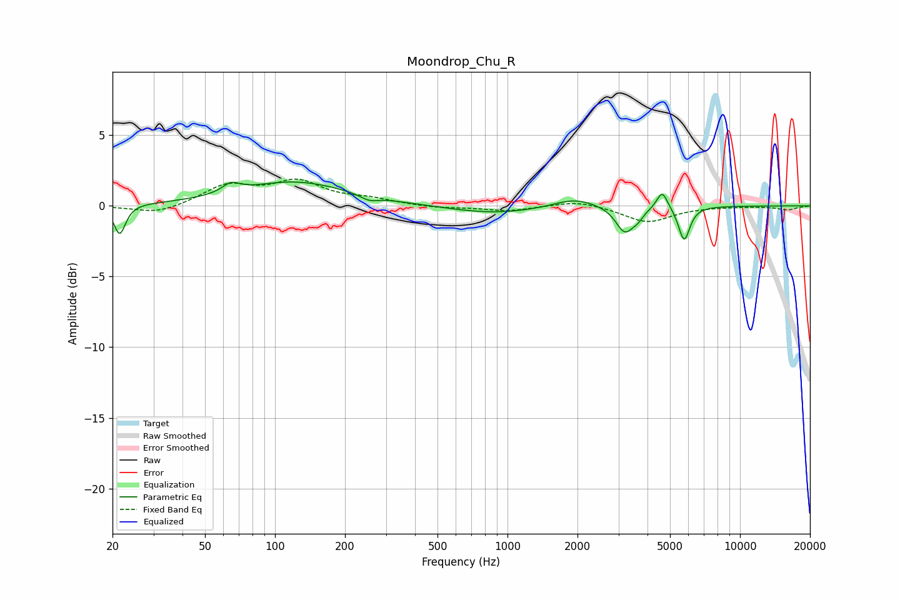

# Moondrop_Chu_R
See [usage instructions](https://github.com/jaakkopasanen/AutoEq#usage) for more options and info.

### Parametric EQs
Apply preamp of -1.8 dB when using parametric equalizer.

|   # | Type    |   Fc (Hz) |    Q |   Gain (dB) |
|-----|---------|-----------|------|-------------|
|   1 | Peaking |        21 | 5.93 |        -2.1 |
|   2 | Peaking |        65 | 3.86 |         0.7 |
|   3 | Peaking |       121 | 0.61 |         1.7 |
|   4 | Peaking |       254 | 3.71 |        -0.4 |
|   5 | Peaking |       875 | 0.71 |        -0.6 |
|   6 | Peaking |      1945 | 1.55 |         0.7 |
|   7 | Peaking |      3195 | 3.67 |        -1.8 |
|   8 | Peaking |      3637 | 5.99 |        -0.4 |
|   9 | Peaking |      4628 | 5.97 |         1.3 |
|  10 | Peaking |      5753 | 5.79 |        -2.4 |

### Fixed Band EQs
When using fixed band (also called graphic) equalizer, apply preamp of **-2.0 dB** (if available) and set gains manually with these parameters.

|   # | Type    |   Fc (Hz) |    Q |   Gain (dB) |
|-----|---------|-----------|------|-------------|
|   1 | Peaking |        31 | 1.41 |        -0.6 |
|   2 | Peaking |        62 | 1.41 |         1.4 |
|   3 | Peaking |       125 | 1.41 |         1.6 |
|   4 | Peaking |       250 | 1.41 |         0.4 |
|   5 | Peaking |       500 | 1.41 |        -0.2 |
|   6 | Peaking |      1000 | 1.41 |        -0.4 |
|   7 | Peaking |      2000 | 1.41 |         0.4 |
|   8 | Peaking |      4000 | 1.41 |        -1.2 |
|   9 | Peaking |      8000 | 1.41 |        -0   |
|  10 | Peaking |     16000 | 1.41 |        -0.3 |

### Graphs

