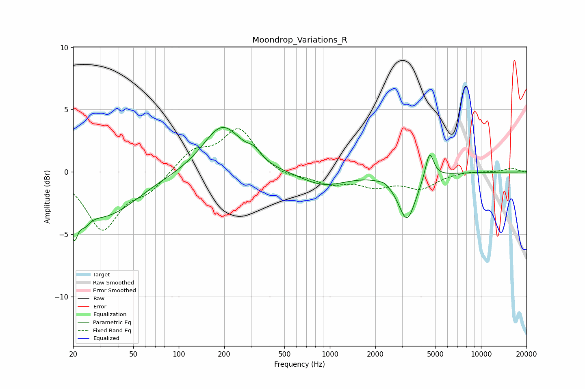

# Moondrop_Variations_R
See [usage instructions](https://github.com/jaakkopasanen/AutoEq#usage) for more options and info.

### Parametric EQs
Apply preamp of -3.7 dB when using parametric equalizer.

|   # | Type    |   Fc (Hz) |    Q |   Gain (dB) |
|-----|---------|-----------|------|-------------|
|   1 | Peaking |        20 | 5.65 |        -2.7 |
|   2 | Peaking |        24 | 4.13 |        -0.9 |
|   3 | Peaking |        32 | 0.65 |        -3.5 |
|   4 | Peaking |       194 | 1.12 |         3.8 |
|   5 | Peaking |       316 | 3.28 |         0.7 |
|   6 | Peaking |       907 | 0.94 |        -1.1 |
|   7 | Peaking |      2359 | 5.64 |         0.8 |
|   8 | Peaking |      2373 | 6    |        -0.7 |
|   9 | Peaking |      3239 | 2.44 |        -3.7 |
|  10 | Peaking |      4568 | 5.05 |         2.3 |

### Fixed Band EQs
When using fixed band (also called graphic) equalizer, apply preamp of **-3.6 dB** (if available) and set gains manually with these parameters.

|   # | Type    |   Fc (Hz) |    Q |   Gain (dB) |
|-----|---------|-----------|------|-------------|
|   1 | Peaking |        31 | 1.41 |        -4.5 |
|   2 | Peaking |        62 | 1.41 |        -1.3 |
|   3 | Peaking |       125 | 1.41 |         1.6 |
|   4 | Peaking |       250 | 1.41 |         3.4 |
|   5 | Peaking |       500 | 1.41 |        -0.5 |
|   6 | Peaking |      1000 | 1.41 |        -0.9 |
|   7 | Peaking |      2000 | 1.41 |        -1   |
|   8 | Peaking |      4000 | 1.41 |        -1.2 |
|   9 | Peaking |      8000 | 1.41 |         0.1 |
|  10 | Peaking |     16000 | 1.41 |         0.3 |

### Graphs

