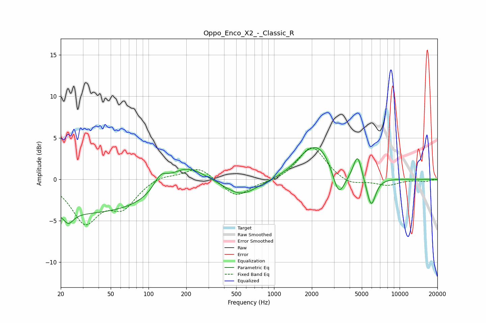

# Oppo_Enco_X2_-_Classic_R
See [usage instructions](https://github.com/jaakkopasanen/AutoEq#usage) for more options and info.

### Parametric EQs
Apply preamp of -3.9 dB when using parametric equalizer.

|   # | Type    |   Fc (Hz) |    Q |   Gain (dB) |
|-----|---------|-----------|------|-------------|
|   1 | Peaking |        23 | 3.78 |        -1.3 |
|   2 | Peaking |        32 | 0.18 |        -4.1 |
|   3 | Peaking |       125 | 2.57 |         1.7 |
|   4 | Peaking |       196 | 0.91 |         3.1 |
|   5 | Peaking |       548 | 1.09 |        -2   |
|   6 | Peaking |      1759 | 1.49 |         1.1 |
|   7 | Peaking |      2306 | 1.19 |         3.8 |
|   8 | Peaking |      3271 | 2.8  |        -3.6 |
|   9 | Peaking |      4628 | 4.26 |         2.9 |
|  10 | Peaking |      5932 | 3.83 |        -3.6 |

### Fixed Band EQs
When using fixed band (also called graphic) equalizer, apply preamp of **-3.9 dB** (if available) and set gains manually with these parameters.

|   # | Type    |   Fc (Hz) |    Q |   Gain (dB) |
|-----|---------|-----------|------|-------------|
|   1 | Peaking |        31 | 1.41 |        -4.9 |
|   2 | Peaking |        62 | 1.41 |        -3   |
|   3 | Peaking |       125 | 1.41 |         0.6 |
|   4 | Peaking |       250 | 1.41 |         1.6 |
|   5 | Peaking |       500 | 1.41 |        -2.2 |
|   6 | Peaking |      1000 | 1.41 |        -0.3 |
|   7 | Peaking |      2000 | 1.41 |         4.1 |
|   8 | Peaking |      4000 | 1.41 |        -0.8 |
|   9 | Peaking |      8000 | 1.41 |        -0.7 |
|  10 | Peaking |     16000 | 1.41 |        -0.2 |

### Graphs

