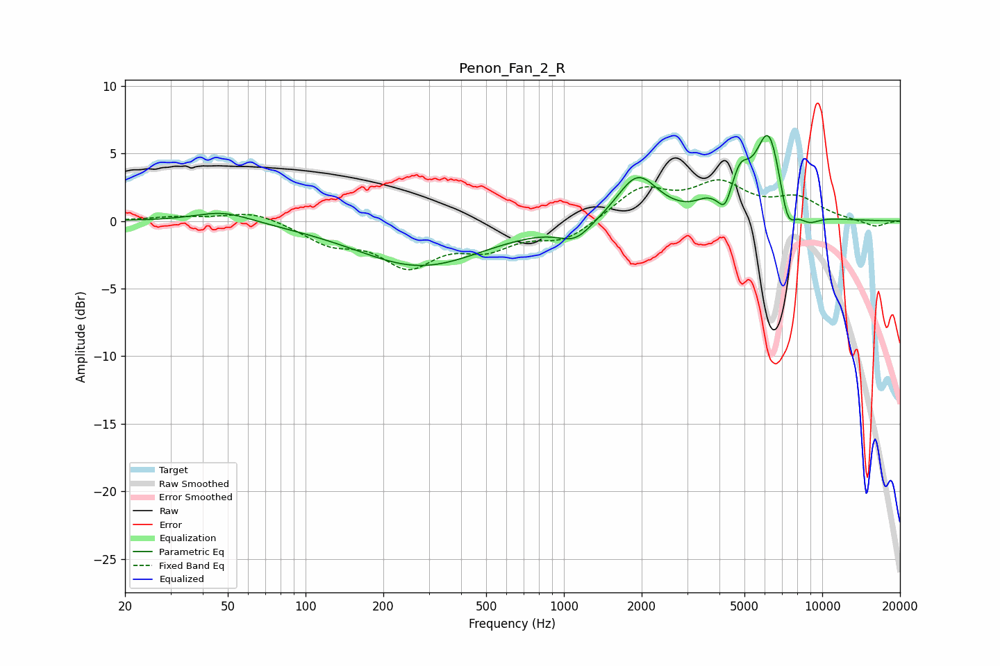

# Penon_Fan_2_R
See [usage instructions](https://github.com/jaakkopasanen/AutoEq#usage) for more options and info.

### Parametric EQs
Apply preamp of -6.4 dB when using parametric equalizer.

|   # | Type    |   Fc (Hz) |    Q |   Gain (dB) |
|-----|---------|-----------|------|-------------|
|   1 | Peaking |        48 | 1.29 |         0.8 |
|   2 | Peaking |       278 | 0.57 |        -3.3 |
|   3 | Peaking |      1108 | 2.19 |        -1.3 |
|   4 | Peaking |      1928 | 1.8  |         3.4 |
|   5 | Peaking |      3585 | 3.12 |         0.7 |
|   6 | Peaking |      4205 | 6    |        -1.3 |
|   7 | Peaking |      4811 | 3.9  |         2.4 |
|   8 | Peaking |      6218 | 2.59 |         6.6 |
|   9 | Peaking |      7329 | 4.23 |        -2.7 |
|  10 | Peaking |      8856 | 2.91 |        -0.8 |

### Fixed Band EQs
When using fixed band (also called graphic) equalizer, apply preamp of **-3.1 dB** (if available) and set gains manually with these parameters.

|   # | Type    |   Fc (Hz) |    Q |   Gain (dB) |
|-----|---------|-----------|------|-------------|
|   1 | Peaking |        31 | 1.41 |         0.3 |
|   2 | Peaking |        62 | 1.41 |         0.8 |
|   3 | Peaking |       125 | 1.41 |        -1.5 |
|   4 | Peaking |       250 | 1.41 |        -3   |
|   5 | Peaking |       500 | 1.41 |        -1.7 |
|   6 | Peaking |      1000 | 1.41 |        -1.4 |
|   7 | Peaking |      2000 | 1.41 |         2.3 |
|   8 | Peaking |      4000 | 1.41 |         2.5 |
|   9 | Peaking |      8000 | 1.41 |         1.5 |
|  10 | Peaking |     16000 | 1.41 |        -0.5 |

### Graphs

