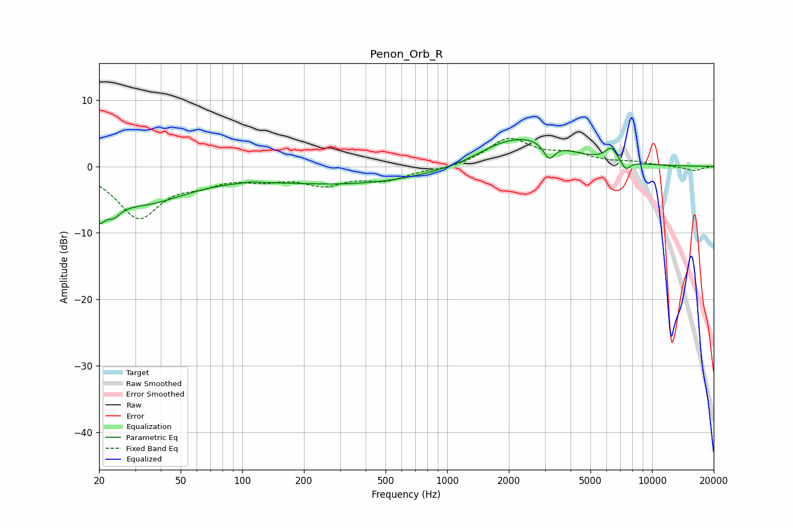

# Penon_Orb_R
See [usage instructions](https://github.com/jaakkopasanen/AutoEq#usage) for more options and info.

### Parametric EQs
Apply preamp of -4.1 dB when using parametric equalizer.

|   # | Type    |   Fc (Hz) |    Q |   Gain (dB) |
|-----|---------|-----------|------|-------------|
|   1 | Peaking |        20 | 5.39 |        -3.5 |
|   2 | Peaking |        23 | 3.78 |        -2.2 |
|   3 | Peaking |        31 | 0.61 |        -5.3 |
|   4 | Peaking |       110 | 5.03 |         0.2 |
|   5 | Peaking |       340 | 0.34 |        -2.6 |
|   6 | Peaking |      1739 | 1.41 |         0.8 |
|   7 | Peaking |      2467 | 0.76 |         4.2 |
|   8 | Peaking |      3144 | 5.28 |        -2.4 |
|   9 | Peaking |      6335 | 4.64 |         2   |
|  10 | Peaking |      7436 | 5.83 |        -1.4 |

### Fixed Band EQs
When using fixed band (also called graphic) equalizer, apply preamp of **-4.3 dB** (if available) and set gains manually with these parameters.

|   # | Type    |   Fc (Hz) |    Q |   Gain (dB) |
|-----|---------|-----------|------|-------------|
|   1 | Peaking |        31 | 1.41 |        -7.5 |
|   2 | Peaking |        62 | 1.41 |        -1.8 |
|   3 | Peaking |       125 | 1.41 |        -1.5 |
|   4 | Peaking |       250 | 1.41 |        -2.4 |
|   5 | Peaking |       500 | 1.41 |        -1.8 |
|   6 | Peaking |      1000 | 1.41 |        -0.4 |
|   7 | Peaking |      2000 | 1.41 |         4.1 |
|   8 | Peaking |      4000 | 1.41 |         1.6 |
|   9 | Peaking |      8000 | 1.41 |         0.5 |
|  10 | Peaking |     16000 | 1.41 |        -0.7 |

### Graphs

