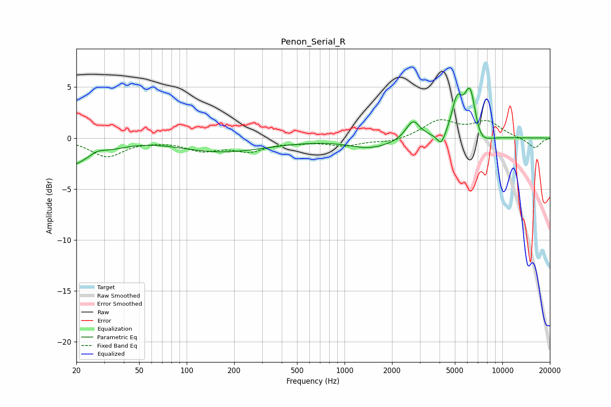

# Penon_Serial_R
See [usage instructions](https://github.com/jaakkopasanen/AutoEq#usage) for more options and info.

### Parametric EQs
Apply preamp of -5.0 dB when using parametric equalizer.

|   # | Type    |   Fc (Hz) |    Q |   Gain (dB) |
|-----|---------|-----------|------|-------------|
|   1 | Peaking |        27 | 2.54 |         0.6 |
|   2 | Peaking |        36 | 0.18 |        -7.1 |
|   3 | Peaking |        50 | 0.35 |         6.2 |
|   4 | Peaking |      1510 | 1.05 |        -1.1 |
|   5 | Peaking |      1627 | 1.92 |         0.1 |
|   6 | Peaking |      2715 | 3.15 |         1.9 |
|   7 | Peaking |      4095 | 5.48 |        -1.3 |
|   8 | Peaking |      5159 | 4.31 |         3.2 |
|   9 | Peaking |      6253 | 3.53 |         5.2 |
|  10 | Peaking |      7112 | 2.41 |        -1.7 |

### Fixed Band EQs
When using fixed band (also called graphic) equalizer, apply preamp of **-1.9 dB** (if available) and set gains manually with these parameters.

|   # | Type    |   Fc (Hz) |    Q |   Gain (dB) |
|-----|---------|-----------|------|-------------|
|   1 | Peaking |        31 | 1.41 |        -1.8 |
|   2 | Peaking |        62 | 1.41 |        -0.1 |
|   3 | Peaking |       125 | 1.41 |        -1.1 |
|   4 | Peaking |       250 | 1.41 |        -1.1 |
|   5 | Peaking |       500 | 1.41 |        -0.3 |
|   6 | Peaking |      1000 | 1.41 |        -0.7 |
|   7 | Peaking |      2000 | 1.41 |        -0.4 |
|   8 | Peaking |      4000 | 1.41 |         1.7 |
|   9 | Peaking |      8000 | 1.41 |         1.5 |
|  10 | Peaking |     16000 | 1.41 |        -1   |

### Graphs

