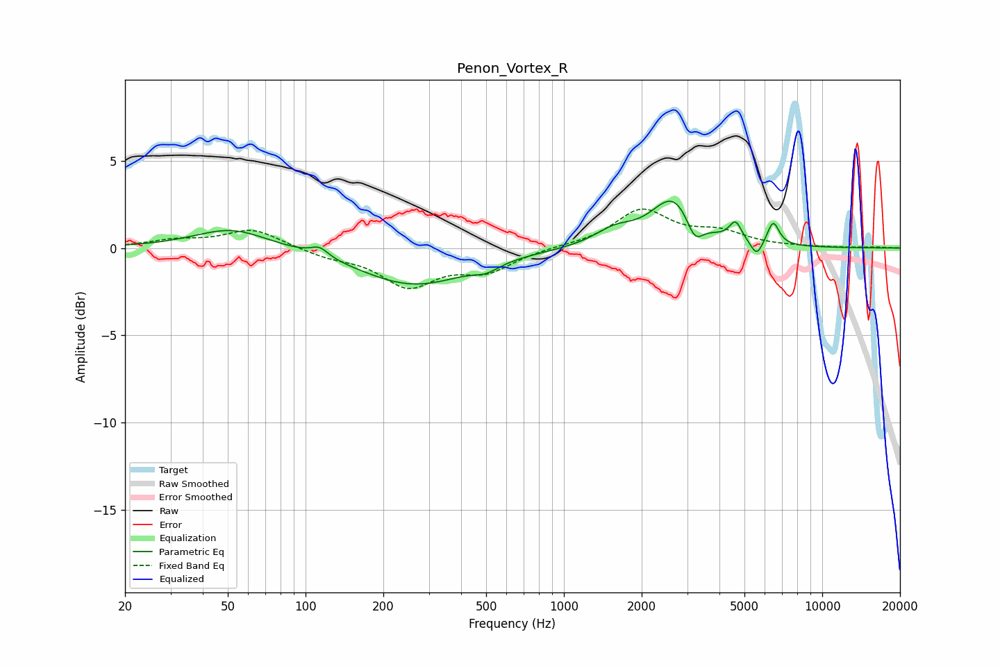

# Penon_Vortex_R
See [usage instructions](https://github.com/jaakkopasanen/AutoEq#usage) for more options and info.

### Parametric EQs
Apply preamp of -2.8 dB when using parametric equalizer.

|   # | Type    |   Fc (Hz) |    Q |   Gain (dB) |
|-----|---------|-----------|------|-------------|
|   1 | Peaking |        52 | 0.99 |         1.2 |
|   2 | Peaking |       113 | 4.16 |         0.5 |
|   3 | Peaking |       263 | 0.67 |        -2.1 |
|   4 | Peaking |       501 | 2.9  |        -0.4 |
|   5 | Peaking |      1568 | 1.8  |         0.8 |
|   6 | Peaking |      2670 | 1.64 |         2.9 |
|   7 | Peaking |      3206 | 4.23 |        -1.4 |
|   8 | Peaking |      4616 | 5.99 |         1.1 |
|   9 | Peaking |      5576 | 6    |        -0.9 |
|  10 | Peaking |      6459 | 6    |         1.4 |

### Fixed Band EQs
When using fixed band (also called graphic) equalizer, apply preamp of **-2.3 dB** (if available) and set gains manually with these parameters.

|   # | Type    |   Fc (Hz) |    Q |   Gain (dB) |
|-----|---------|-----------|------|-------------|
|   1 | Peaking |        31 | 1.41 |         0.4 |
|   2 | Peaking |        62 | 1.41 |         1.1 |
|   3 | Peaking |       125 | 1.41 |        -0.4 |
|   4 | Peaking |       250 | 1.41 |        -2.1 |
|   5 | Peaking |       500 | 1.41 |        -1.2 |
|   6 | Peaking |      1000 | 1.41 |         0.1 |
|   7 | Peaking |      2000 | 1.41 |         2.1 |
|   8 | Peaking |      4000 | 1.41 |         0.8 |
|   9 | Peaking |      8000 | 1.41 |         0   |
|  10 | Peaking |     16000 | 1.41 |         0.1 |

### Graphs

