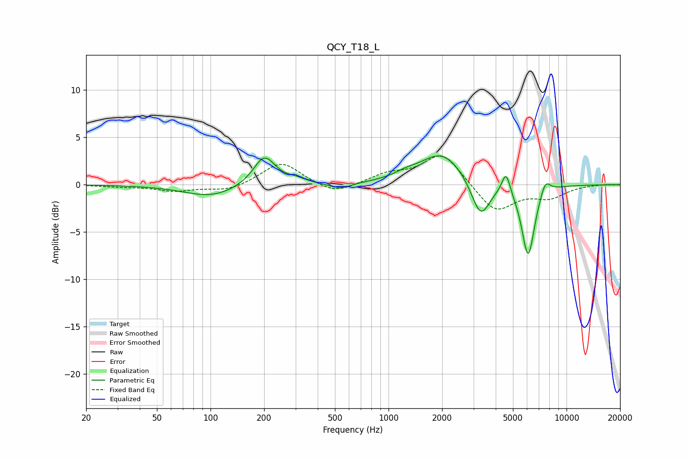

# QCY_T18_L
See [usage instructions](https://github.com/jaakkopasanen/AutoEq#usage) for more options and info.

### Parametric EQs
Apply preamp of -3.1 dB when using parametric equalizer.

|   # | Type    |   Fc (Hz) |    Q |   Gain (dB) |
|-----|---------|-----------|------|-------------|
|   1 | Peaking |       101 | 0.94 |        -1.3 |
|   2 | Peaking |       201 | 2.28 |         3.2 |
|   3 | Peaking |       303 | 2.51 |         0.4 |
|   4 | Peaking |       537 | 2.36 |        -0.6 |
|   5 | Peaking |      1241 | 2.11 |         0.5 |
|   6 | Peaking |      2002 | 1.14 |         3.4 |
|   7 | Peaking |      3288 | 2.68 |        -4   |
|   8 | Peaking |      4575 | 5.94 |         2.3 |
|   9 | Peaking |      6090 | 3.74 |        -7.7 |
|  10 | Peaking |      7599 | 4.77 |         1.5 |

### Fixed Band EQs
When using fixed band (also called graphic) equalizer, apply preamp of **-3.1 dB** (if available) and set gains manually with these parameters.

|   # | Type    |   Fc (Hz) |    Q |   Gain (dB) |
|-----|---------|-----------|------|-------------|
|   1 | Peaking |        31 | 1.41 |        -0.2 |
|   2 | Peaking |        62 | 1.41 |        -0.6 |
|   3 | Peaking |       125 | 1.41 |        -0.7 |
|   4 | Peaking |       250 | 1.41 |         2.4 |
|   5 | Peaking |       500 | 1.41 |        -1.1 |
|   6 | Peaking |      1000 | 1.41 |         1   |
|   7 | Peaking |      2000 | 1.41 |         3.4 |
|   8 | Peaking |      4000 | 1.41 |        -3   |
|   9 | Peaking |      8000 | 1.41 |        -1.2 |
|  10 | Peaking |     16000 | 1.41 |         0.1 |

### Graphs

