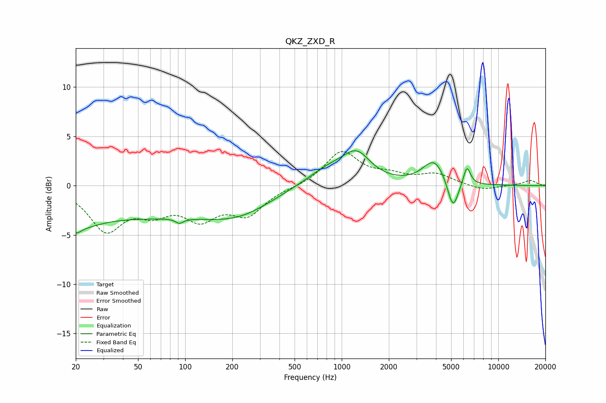

# QKZ_ZXD_R
See [usage instructions](https://github.com/jaakkopasanen/AutoEq#usage) for more options and info.

### Parametric EQs
Apply preamp of -3.6 dB when using parametric equalizer.

|   # | Type    |   Fc (Hz) |    Q |   Gain (dB) |
|-----|---------|-----------|------|-------------|
|   1 | Peaking |        20 | 4.49 |        -0.9 |
|   2 | Peaking |        22 | 1.24 |        -1.1 |
|   3 | Peaking |        39 | 0.19 |        -3.1 |
|   4 | Peaking |        92 | 5.98 |        -0.5 |
|   5 | Peaking |       225 | 0.68 |        -1.8 |
|   6 | Peaking |       841 | 0.93 |         1.8 |
|   7 | Peaking |      1251 | 1.66 |         2.5 |
|   8 | Peaking |      3902 | 1.96 |         2.5 |
|   9 | Peaking |      5133 | 3.98 |        -3.1 |
|  10 | Peaking |      6303 | 6    |         1.9 |

### Fixed Band EQs
When using fixed band (also called graphic) equalizer, apply preamp of **-3.6 dB** (if available) and set gains manually with these parameters.

|   # | Type    |   Fc (Hz) |    Q |   Gain (dB) |
|-----|---------|-----------|------|-------------|
|   1 | Peaking |        31 | 1.41 |        -4.3 |
|   2 | Peaking |        62 | 1.41 |        -2.1 |
|   3 | Peaking |       125 | 1.41 |        -2.9 |
|   4 | Peaking |       250 | 1.41 |        -2.7 |
|   5 | Peaking |       500 | 1.41 |        -0.1 |
|   6 | Peaking |      1000 | 1.41 |         3.4 |
|   7 | Peaking |      2000 | 1.41 |         0.8 |
|   8 | Peaking |      4000 | 1.41 |         1.1 |
|   9 | Peaking |      8000 | 1.41 |        -0.5 |
|  10 | Peaking |     16000 | 1.41 |         0.5 |

### Graphs

