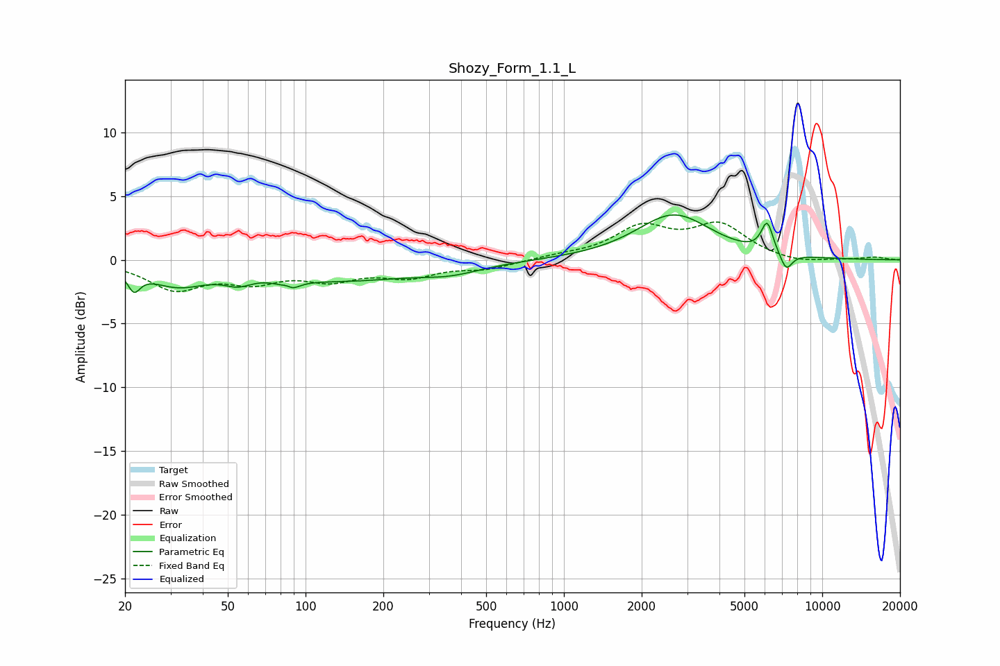

# Shozy_Form_1.1_L
See [usage instructions](https://github.com/jaakkopasanen/AutoEq#usage) for more options and info.

### Parametric EQs
Apply preamp of -3.6 dB when using parametric equalizer.

|   # | Type    |   Fc (Hz) |    Q |   Gain (dB) |
|-----|---------|-----------|------|-------------|
|   1 | Peaking |        22 | 5.87 |        -1.5 |
|   2 | Peaking |        32 | 1.23 |        -1.7 |
|   3 | Peaking |        55 | 2.65 |        -0.7 |
|   4 | Peaking |        85 | 5.68 |         1.5 |
|   5 | Peaking |        86 | 4.66 |        -2   |
|   6 | Peaking |       135 | 0.49 |        -1.5 |
|   7 | Peaking |       363 | 1.16 |        -0.7 |
|   8 | Peaking |      2665 | 0.98 |         3.5 |
|   9 | Peaking |      6120 | 6    |         2.4 |
|  10 | Peaking |      7251 | 5.72 |        -1.4 |

### Fixed Band EQs
When using fixed band (also called graphic) equalizer, apply preamp of **-3.1 dB** (if available) and set gains manually with these parameters.

|   # | Type    |   Fc (Hz) |    Q |   Gain (dB) |
|-----|---------|-----------|------|-------------|
|   1 | Peaking |        31 | 1.41 |        -2.2 |
|   2 | Peaking |        62 | 1.41 |        -1.4 |
|   3 | Peaking |       125 | 1.41 |        -1.3 |
|   4 | Peaking |       250 | 1.41 |        -1.2 |
|   5 | Peaking |       500 | 1.41 |        -0.6 |
|   6 | Peaking |      1000 | 1.41 |         0.3 |
|   7 | Peaking |      2000 | 1.41 |         2.4 |
|   8 | Peaking |      4000 | 1.41 |         2.6 |
|   9 | Peaking |      8000 | 1.41 |        -0.3 |
|  10 | Peaking |     16000 | 1.41 |         0.2 |

### Graphs

