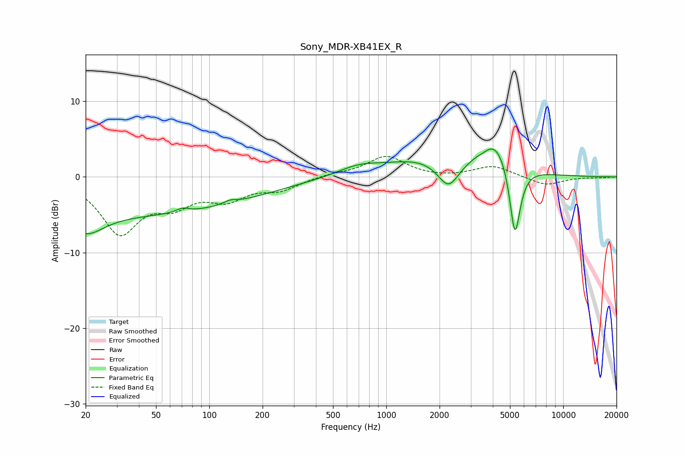

# Sony_MDR-XB41EX_R
See [usage instructions](https://github.com/jaakkopasanen/AutoEq#usage) for more options and info.

### Parametric EQs
Apply preamp of -3.8 dB when using parametric equalizer.

|   # | Type    |   Fc (Hz) |    Q |   Gain (dB) |
|-----|---------|-----------|------|-------------|
|   1 | Peaking |        20 | 1.42 |        -2.9 |
|   2 | Peaking |        37 | 0.18 |        -4.9 |
|   3 | Peaking |        70 | 4.19 |         0.5 |
|   4 | Peaking |       132 | 3.82 |         0.4 |
|   5 | Peaking |       694 | 1.17 |         1.1 |
|   6 | Peaking |      1539 | 0.67 |         2.1 |
|   7 | Peaking |      2245 | 2.39 |        -3.5 |
|   8 | Peaking |      3557 | 4.44 |        -0.3 |
|   9 | Peaking |      4169 | 1.39 |         5   |
|  10 | Peaking |      5334 | 4.36 |       -10.4 |

### Fixed Band EQs
When using fixed band (also called graphic) equalizer, apply preamp of **-2.8 dB** (if available) and set gains manually with these parameters.

|   # | Type    |   Fc (Hz) |    Q |   Gain (dB) |
|-----|---------|-----------|------|-------------|
|   1 | Peaking |        31 | 1.41 |        -7.1 |
|   2 | Peaking |        62 | 1.41 |        -2.9 |
|   3 | Peaking |       125 | 1.41 |        -2.5 |
|   4 | Peaking |       250 | 1.41 |        -1.5 |
|   5 | Peaking |       500 | 1.41 |         0.4 |
|   6 | Peaking |      1000 | 1.41 |         2.7 |
|   7 | Peaking |      2000 | 1.41 |        -0.2 |
|   8 | Peaking |      4000 | 1.41 |         1.5 |
|   9 | Peaking |      8000 | 1.41 |        -1.1 |
|  10 | Peaking |     16000 | 1.41 |        -0.1 |

### Graphs

