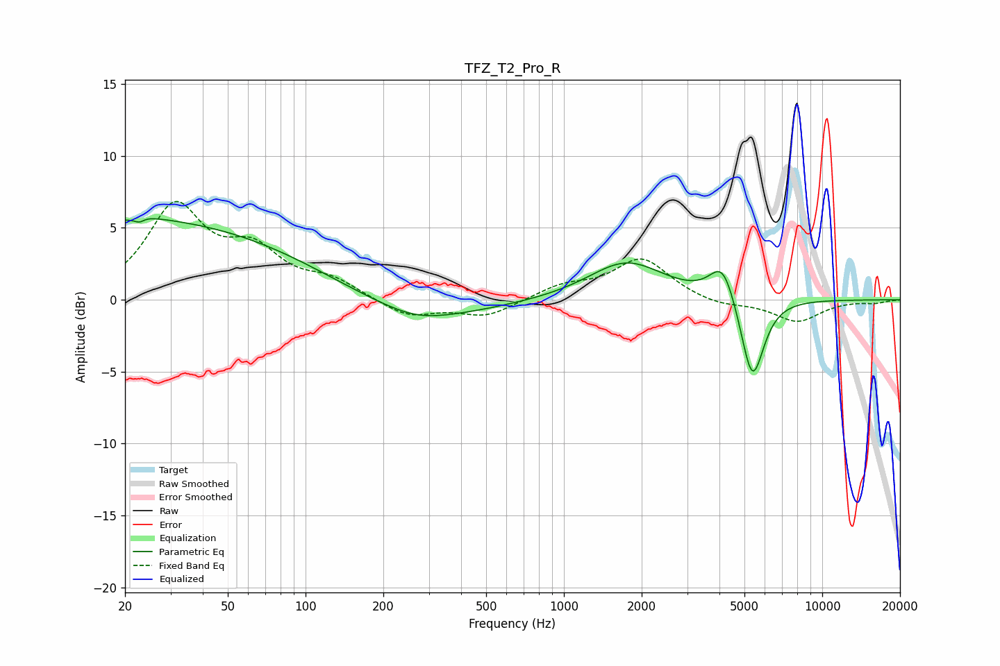

# TFZ_T2_Pro_R
See [usage instructions](https://github.com/jaakkopasanen/AutoEq#usage) for more options and info.

### Parametric EQs
Apply preamp of -5.7 dB when using parametric equalizer.

|   # | Type    |   Fc (Hz) |    Q |   Gain (dB) |
|-----|---------|-----------|------|-------------|
|   1 | Peaking |        20 | 0.18 |         5.6 |
|   2 | Peaking |        20 | 2.64 |        -0.3 |
|   3 | Peaking |        21 | 1.15 |         0.4 |
|   4 | Peaking |        23 | 5.9  |        -3.5 |
|   5 | Peaking |        23 | 5.71 |         3.3 |
|   6 | Peaking |       269 | 1.2  |        -0.5 |
|   7 | Peaking |       270 | 0.51 |        -1.4 |
|   8 | Peaking |      1742 | 0.97 |         2.7 |
|   9 | Peaking |      4124 | 2.81 |         2.7 |
|  10 | Peaking |      5364 | 3.08 |        -6   |

### Fixed Band EQs
When using fixed band (also called graphic) equalizer, apply preamp of **-6.9 dB** (if available) and set gains manually with these parameters.

|   # | Type    |   Fc (Hz) |    Q |   Gain (dB) |
|-----|---------|-----------|------|-------------|
|   1 | Peaking |        31 | 1.41 |         6.3 |
|   2 | Peaking |        62 | 1.41 |         2.9 |
|   3 | Peaking |       125 | 1.41 |         1.2 |
|   4 | Peaking |       250 | 1.41 |        -1.2 |
|   5 | Peaking |       500 | 1.41 |        -1.1 |
|   6 | Peaking |      1000 | 1.41 |         0.9 |
|   7 | Peaking |      2000 | 1.41 |         2.8 |
|   8 | Peaking |      4000 | 1.41 |        -0.5 |
|   9 | Peaking |      8000 | 1.41 |        -1.5 |
|  10 | Peaking |     16000 | 1.41 |        -0.2 |

### Graphs

