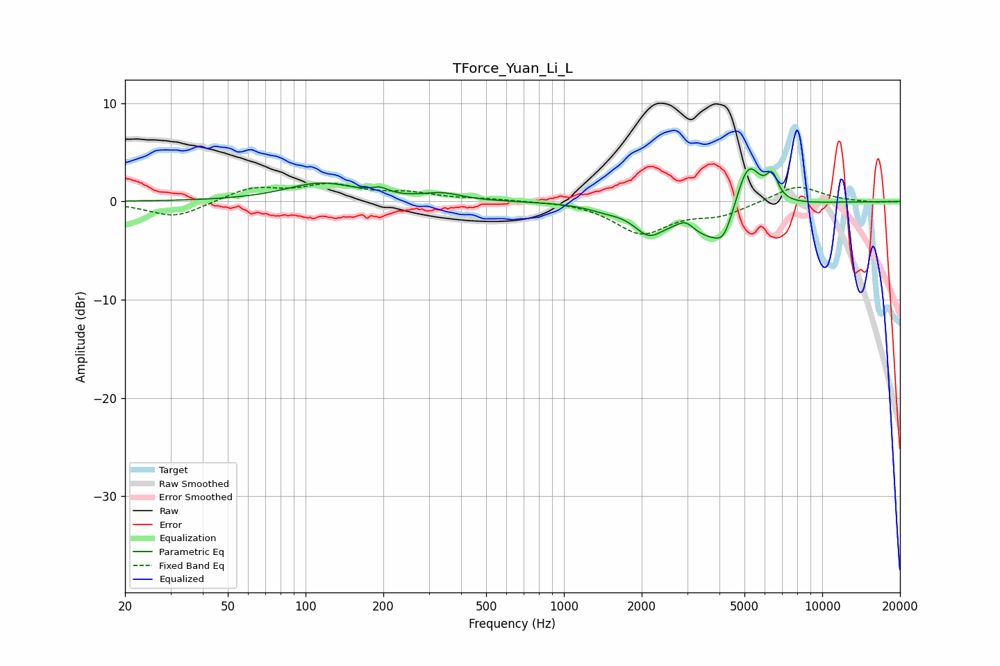

# TForce_Yuan_Li_L
See [usage instructions](https://github.com/jaakkopasanen/AutoEq#usage) for more options and info.

### Parametric EQs
Apply preamp of -3.4 dB when using parametric equalizer.

|   # | Type    |   Fc (Hz) |    Q |   Gain (dB) |
|-----|---------|-----------|------|-------------|
|   1 | Peaking |       115 | 1.03 |         1.8 |
|   2 | Peaking |       194 | 4.54 |         0.6 |
|   3 | Peaking |       339 | 1.94 |         0.7 |
|   4 | Peaking |      1443 | 2.2  |        -0.4 |
|   5 | Peaking |      2126 | 2.51 |        -2.3 |
|   6 | Peaking |      2961 | 4.09 |         1.1 |
|   7 | Peaking |      3729 | 1.18 |        -4   |
|   8 | Peaking |      4160 | 4.06 |        -1.9 |
|   9 | Peaking |      5153 | 2.69 |         5.7 |
|  10 | Peaking |      6405 | 6    |         2.3 |

### Fixed Band EQs
When using fixed band (also called graphic) equalizer, apply preamp of **-2.0 dB** (if available) and set gains manually with these parameters.

|   # | Type    |   Fc (Hz) |    Q |   Gain (dB) |
|-----|---------|-----------|------|-------------|
|   1 | Peaking |        31 | 1.41 |        -1.7 |
|   2 | Peaking |        62 | 1.41 |         1.4 |
|   3 | Peaking |       125 | 1.41 |         1.5 |
|   4 | Peaking |       250 | 1.41 |         0.7 |
|   5 | Peaking |       500 | 1.41 |         0.2 |
|   6 | Peaking |      1000 | 1.41 |         0.1 |
|   7 | Peaking |      2000 | 1.41 |        -3.2 |
|   8 | Peaking |      4000 | 1.41 |        -1.2 |
|   9 | Peaking |      8000 | 1.41 |         1.7 |
|  10 | Peaking |     16000 | 1.41 |        -0.1 |

### Graphs

