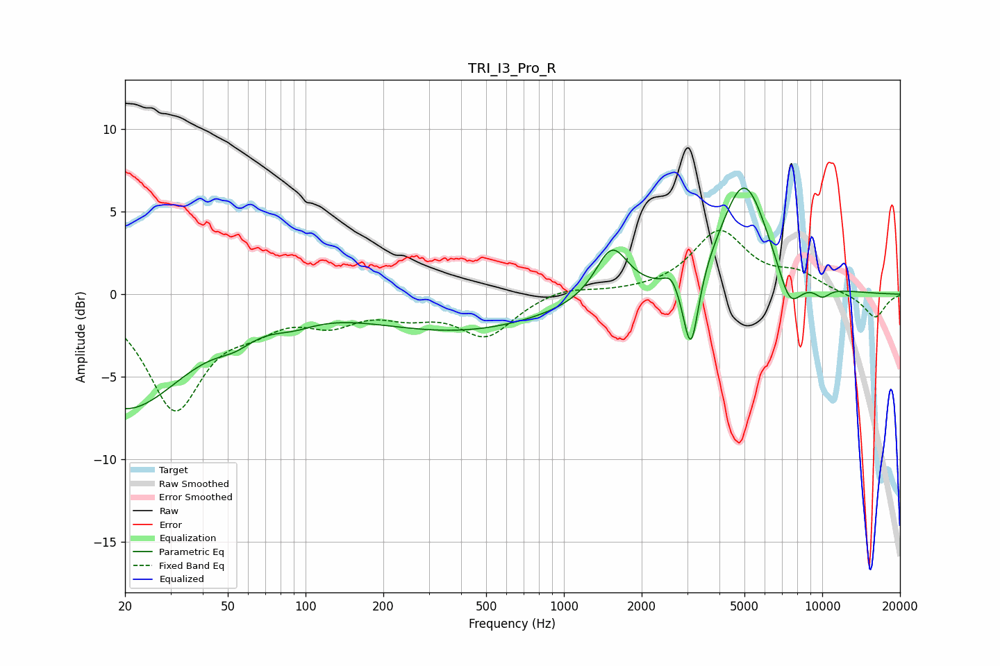

# TRI_I3_Pro_R
See [usage instructions](https://github.com/jaakkopasanen/AutoEq#usage) for more options and info.

### Parametric EQs
Apply preamp of -6.5 dB when using parametric equalizer.

|   # | Type    |   Fc (Hz) |    Q |   Gain (dB) |
|-----|---------|-----------|------|-------------|
|   1 | Peaking |        20 | 0.61 |        -6.9 |
|   2 | Peaking |        53 | 2.02 |        -0.7 |
|   3 | Peaking |        90 | 1.65 |        -0.6 |
|   4 | Peaking |       396 | 0.39 |        -2.2 |
|   5 | Peaking |      1532 | 2.26 |         3.1 |
|   6 | Peaking |      2602 | 5.32 |         0.7 |
|   7 | Peaking |      3102 | 4.72 |        -5   |
|   8 | Peaking |      4989 | 1.46 |         6.9 |
|   9 | Peaking |      7476 | 2.82 |        -2.4 |
|  10 | Peaking |     10000 | 3.99 |        -0.6 |

### Fixed Band EQs
When using fixed band (also called graphic) equalizer, apply preamp of **-4.0 dB** (if available) and set gains manually with these parameters.

|   # | Type    |   Fc (Hz) |    Q |   Gain (dB) |
|-----|---------|-----------|------|-------------|
|   1 | Peaking |        31 | 1.41 |        -6.8 |
|   2 | Peaking |        62 | 1.41 |        -1.3 |
|   3 | Peaking |       125 | 1.41 |        -1.4 |
|   4 | Peaking |       250 | 1.41 |        -0.9 |
|   5 | Peaking |       500 | 1.41 |        -2.4 |
|   6 | Peaking |      1000 | 1.41 |         0.5 |
|   7 | Peaking |      2000 | 1.41 |         0   |
|   8 | Peaking |      4000 | 1.41 |         3.7 |
|   9 | Peaking |      8000 | 1.41 |         1   |
|  10 | Peaking |     16000 | 1.41 |        -1.5 |

### Graphs

