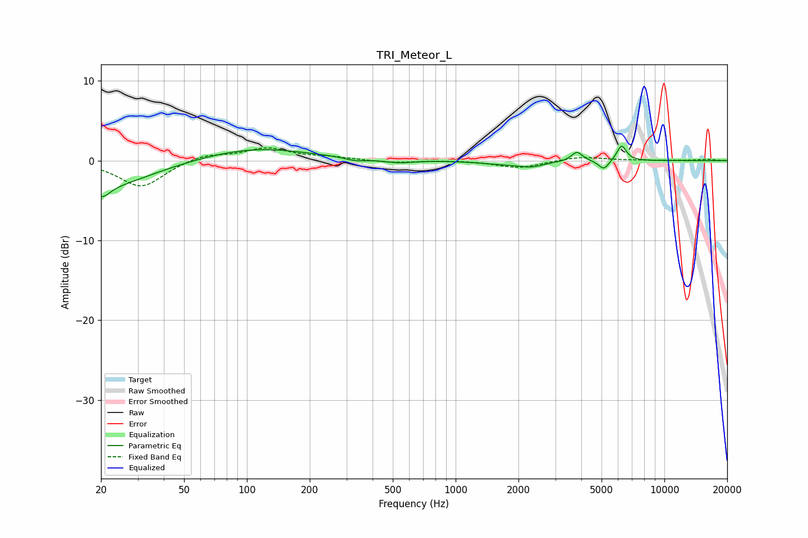

# TRI_Meteor_L
See [usage instructions](https://github.com/jaakkopasanen/AutoEq#usage) for more options and info.

### Parametric EQs
Apply preamp of -1.9 dB when using parametric equalizer.

|   # | Type    |   Fc (Hz) |    Q |   Gain (dB) |
|-----|---------|-----------|------|-------------|
|   1 | Peaking |        20 | 3.93 |        -1.4 |
|   2 | Peaking |        21 | 0.63 |        -3.3 |
|   3 | Peaking |       108 | 0.55 |         1.6 |
|   4 | Peaking |       332 | 2.72 |        -0.4 |
|   5 | Peaking |       533 | 2.11 |        -0.4 |
|   6 | Peaking |      1783 | 1.2  |        -0.5 |
|   7 | Peaking |      2325 | 2.56 |        -0.5 |
|   8 | Peaking |      3812 | 5.38 |         1.2 |
|   9 | Peaking |      5131 | 5.58 |        -1.2 |
|  10 | Peaking |      6239 | 6    |         2   |

### Fixed Band EQs
When using fixed band (also called graphic) equalizer, apply preamp of **-1.7 dB** (if available) and set gains manually with these parameters.

|   # | Type    |   Fc (Hz) |    Q |   Gain (dB) |
|-----|---------|-----------|------|-------------|
|   1 | Peaking |        31 | 1.41 |        -3.4 |
|   2 | Peaking |        62 | 1.41 |         0.8 |
|   3 | Peaking |       125 | 1.41 |         1.5 |
|   4 | Peaking |       250 | 1.41 |         0.4 |
|   5 | Peaking |       500 | 1.41 |        -0.3 |
|   6 | Peaking |      1000 | 1.41 |         0.1 |
|   7 | Peaking |      2000 | 1.41 |        -0.9 |
|   8 | Peaking |      4000 | 1.41 |         0.5 |
|   9 | Peaking |      8000 | 1.41 |         0   |
|  10 | Peaking |     16000 | 1.41 |         0.2 |

### Graphs

