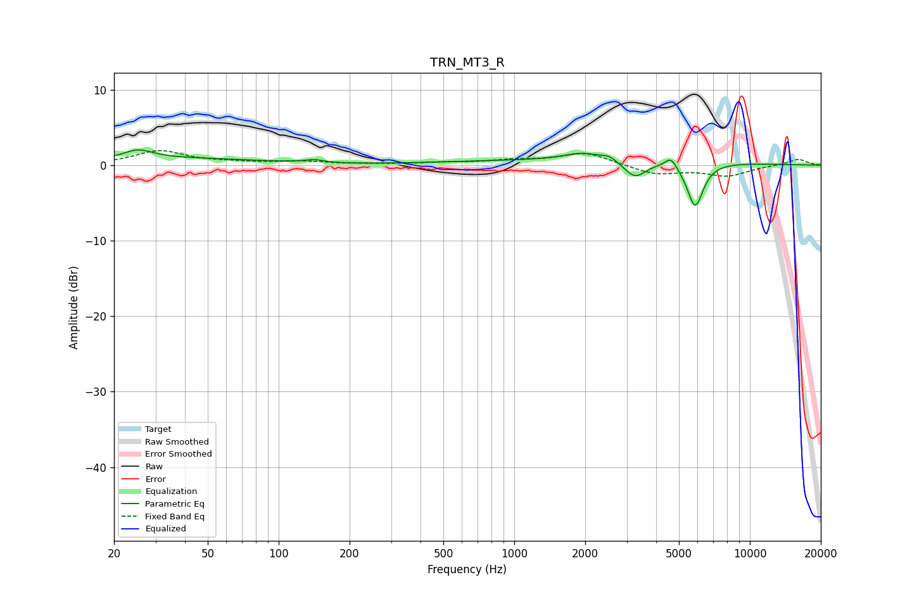

# TRN_MT3_R
See [usage instructions](https://github.com/jaakkopasanen/AutoEq#usage) for more options and info.

### Parametric EQs
Apply preamp of -2.1 dB when using parametric equalizer.

|   # | Type    |   Fc (Hz) |    Q |   Gain (dB) |
|-----|---------|-----------|------|-------------|
|   1 | Peaking |        25 | 2.36 |         1.2 |
|   2 | Peaking |        36 | 0.4  |         0.9 |
|   3 | Peaking |       112 | 2.43 |         0   |
|   4 | Peaking |       142 | 3.82 |         0.4 |
|   5 | Peaking |      1941 | 1.86 |         1   |
|   6 | Peaking |      2161 | 0.22 |         0.7 |
|   7 | Peaking |      2528 | 4.2  |         0.6 |
|   8 | Peaking |      3252 | 3.04 |        -2.2 |
|   9 | Peaking |      4626 | 5.68 |         1.4 |
|  10 | Peaking |      5858 | 4.02 |        -5.9 |

### Fixed Band EQs
When using fixed band (also called graphic) equalizer, apply preamp of **-2.0 dB** (if available) and set gains manually with these parameters.

|   # | Type    |   Fc (Hz) |    Q |   Gain (dB) |
|-----|---------|-----------|------|-------------|
|   1 | Peaking |        31 | 1.41 |         1.9 |
|   2 | Peaking |        62 | 1.41 |         0.3 |
|   3 | Peaking |       125 | 1.41 |         0.4 |
|   4 | Peaking |       250 | 1.41 |         0.1 |
|   5 | Peaking |       500 | 1.41 |         0.3 |
|   6 | Peaking |      1000 | 1.41 |         0.6 |
|   7 | Peaking |      2000 | 1.41 |         1.6 |
|   8 | Peaking |      4000 | 1.41 |        -1.2 |
|   9 | Peaking |      8000 | 1.41 |        -1.4 |
|  10 | Peaking |     16000 | 1.41 |         0.8 |

### Graphs

