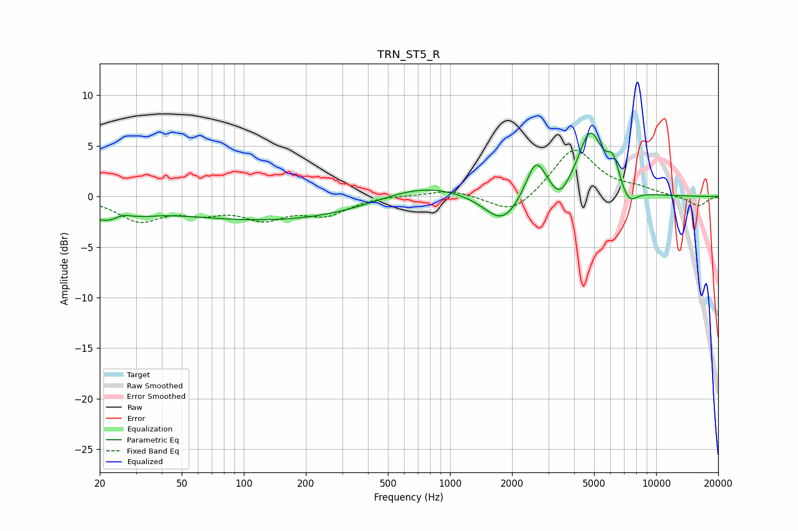

# TRN_ST5_R
See [usage instructions](https://github.com/jaakkopasanen/AutoEq#usage) for more options and info.

### Parametric EQs
Apply preamp of -6.4 dB when using parametric equalizer.

|   # | Type    |   Fc (Hz) |    Q |   Gain (dB) |
|-----|---------|-----------|------|-------------|
|   1 | Peaking |        23 | 1.19 |        -2.3 |
|   2 | Peaking |        26 | 2.96 |         0.9 |
|   3 | Peaking |       145 | 0.28 |        -2.4 |
|   4 | Peaking |       714 | 0.66 |         1.7 |
|   5 | Peaking |      1800 | 1.59 |        -3   |
|   6 | Peaking |      2611 | 2.88 |         3.9 |
|   7 | Peaking |      3411 | 3.24 |        -1.6 |
|   8 | Peaking |      4790 | 2.35 |         6.2 |
|   9 | Peaking |      6187 | 4.62 |         2.5 |
|  10 | Peaking |      7372 | 3.47 |        -1.6 |

### Fixed Band EQs
When using fixed band (also called graphic) equalizer, apply preamp of **-4.7 dB** (if available) and set gains manually with these parameters.

|   # | Type    |   Fc (Hz) |    Q |   Gain (dB) |
|-----|---------|-----------|------|-------------|
|   1 | Peaking |        31 | 1.41 |        -2.3 |
|   2 | Peaking |        62 | 1.41 |        -1.2 |
|   3 | Peaking |       125 | 1.41 |        -1.9 |
|   4 | Peaking |       250 | 1.41 |        -1.6 |
|   5 | Peaking |       500 | 1.41 |         0.1 |
|   6 | Peaking |      1000 | 1.41 |         0.7 |
|   7 | Peaking |      2000 | 1.41 |        -1.9 |
|   8 | Peaking |      4000 | 1.41 |         4.8 |
|   9 | Peaking |      8000 | 1.41 |         0.6 |
|  10 | Peaking |     16000 | 1.41 |        -1   |

### Graphs

