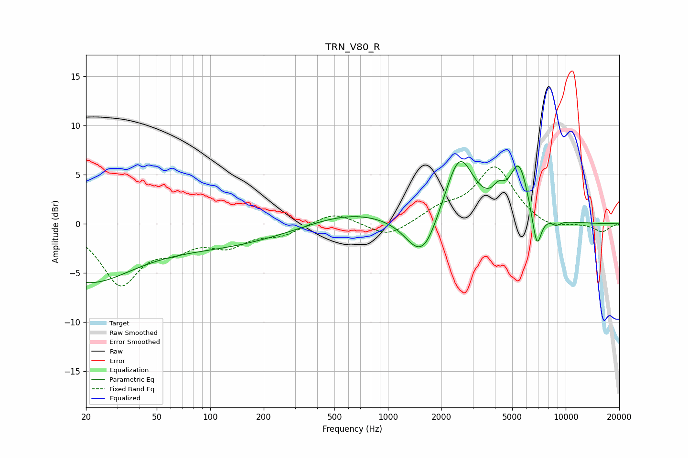

# TRN_V80_R
See [usage instructions](https://github.com/jaakkopasanen/AutoEq#usage) for more options and info.

### Parametric EQs
Apply preamp of -6.4 dB when using parametric equalizer.

|   # | Type    |   Fc (Hz) |    Q |   Gain (dB) |
|-----|---------|-----------|------|-------------|
|   1 | Peaking |        20 | 0.54 |        -5.6 |
|   2 | Peaking |       117 | 0.36 |        -2   |
|   3 | Peaking |       607 | 0.58 |         1.4 |
|   4 | Peaking |      1487 | 1.68 |        -3.3 |
|   5 | Peaking |      1683 | 2.26 |        -1.4 |
|   6 | Peaking |      2526 | 1.74 |         6.9 |
|   7 | Peaking |      4184 | 4.23 |         1.4 |
|   8 | Peaking |      5457 | 2.62 |         5.5 |
|   9 | Peaking |      6878 | 5.16 |        -3.9 |
|  10 | Peaking |      8837 | 4.9  |        -0.5 |

### Fixed Band EQs
When using fixed band (also called graphic) equalizer, apply preamp of **-5.9 dB** (if available) and set gains manually with these parameters.

|   # | Type    |   Fc (Hz) |    Q |   Gain (dB) |
|-----|---------|-----------|------|-------------|
|   1 | Peaking |        31 | 1.41 |        -5.9 |
|   2 | Peaking |        62 | 1.41 |        -1.9 |
|   3 | Peaking |       125 | 1.41 |        -1.9 |
|   4 | Peaking |       250 | 1.41 |        -1   |
|   5 | Peaking |       500 | 1.41 |         1.3 |
|   6 | Peaking |      1000 | 1.41 |        -1.5 |
|   7 | Peaking |      2000 | 1.41 |         1.3 |
|   8 | Peaking |      4000 | 1.41 |         5.7 |
|   9 | Peaking |      8000 | 1.41 |        -0.7 |
|  10 | Peaking |     16000 | 1.41 |        -0.8 |

### Graphs

