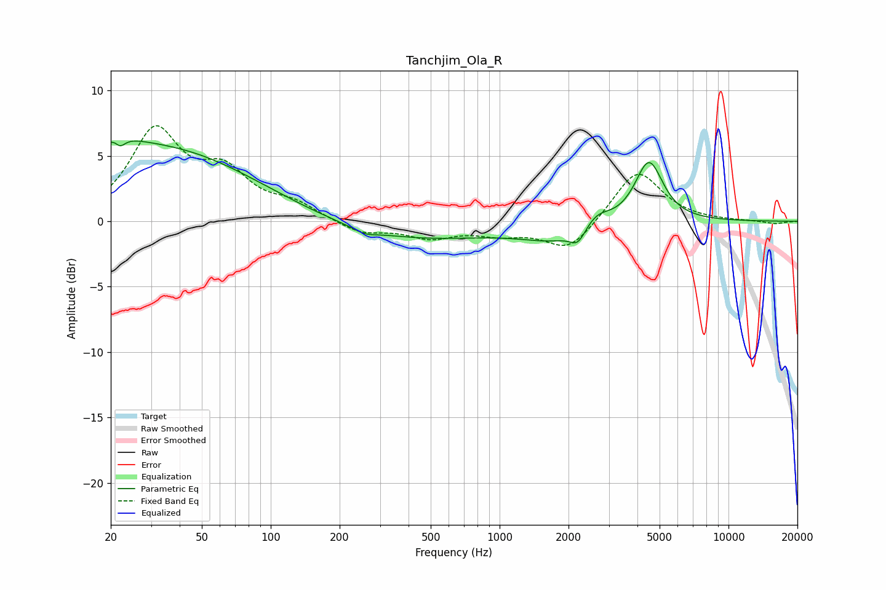

# Tanchjim_Ola_R
See [usage instructions](https://github.com/jaakkopasanen/AutoEq#usage) for more options and info.

### Parametric EQs
Apply preamp of -6.2 dB when using parametric equalizer.

|   # | Type    |   Fc (Hz) |    Q |   Gain (dB) |
|-----|---------|-----------|------|-------------|
|   1 | Peaking |        20 | 1.27 |         1.6 |
|   2 | Peaking |        22 | 5.95 |         3.2 |
|   3 | Peaking |        22 | 6    |        -3.8 |
|   4 | Peaking |        34 | 0.35 |         5.4 |
|   5 | Peaking |       258 | 2.79 |        -0.4 |
|   6 | Peaking |       404 | 0.4  |        -1.4 |
|   7 | Peaking |      1755 | 0.94 |        -1.3 |
|   8 | Peaking |      2199 | 4.19 |        -1.1 |
|   9 | Peaking |      2653 | 2.45 |         1   |
|  10 | Peaking |      4490 | 2.3  |         4.7 |

### Fixed Band EQs
When using fixed band (also called graphic) equalizer, apply preamp of **-7.4 dB** (if available) and set gains manually with these parameters.

|   # | Type    |   Fc (Hz) |    Q |   Gain (dB) |
|-----|---------|-----------|------|-------------|
|   1 | Peaking |        31 | 1.41 |         6.7 |
|   2 | Peaking |        62 | 1.41 |         3.2 |
|   3 | Peaking |       125 | 1.41 |         1.1 |
|   4 | Peaking |       250 | 1.41 |        -0.9 |
|   5 | Peaking |       500 | 1.41 |        -1.1 |
|   6 | Peaking |      1000 | 1.41 |        -0.8 |
|   7 | Peaking |      2000 | 1.41 |        -2.3 |
|   8 | Peaking |      4000 | 1.41 |         4   |
|   9 | Peaking |      8000 | 1.41 |         0   |
|  10 | Peaking |     16000 | 1.41 |        -0.2 |

### Graphs

